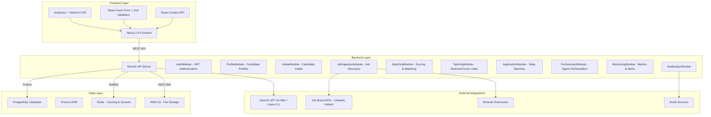

# Apply-as-a-Service V1 Final Project Summary

## 1. Project Overview: Vision and Goals

### Vision
Apply-as-a-Service (AaS) is an end-to-end automation platform designed to streamline the job application process for tech/tech-adjacent professionals in the US and remote-friendly worldwide markets. By combining resume parsing, conversational interviews, and AI-powered role matching, AaS reduces manual effort from hours to minutes while maintaining high application quality.

### Core Objectives
- Automate 80% of the job application process for active users
- Deliver role-specific applications with < 30 minutes of initial setup
- Maintain infrastructure + LLM costs < $5/active user/month at scale (1000 active users)
- Provide a user-friendly interface with comprehensive tracking and controls
- Ensure compliance with legal and ethical standards for automated job applications

## 2. Architecture: High-Level System Architecture

### System Components

### Data Flow
1. **Candidate Intake**: Users complete intake form or upload resume, which is parsed and processed into a canonical profile
2. **Role Discovery**: JobIngestionModule continuously discovers relevant roles from multiple sources
3. **Matching & Scoring**: MatchingModule evaluates role fit using weighted scoring system
4. **Tailoring**: TailoringModule creates ATS-safe, role-specific resumes and cover letters
5. **Application Management**: ApplicationModule manages end-to-end application lifecycle with state machine
6. **Orchestration**: OrchestratorModule coordinates agents for automated processing
7. **Monitoring**: MonitoringModule tracks metrics, alerts, and cost controls

## 3. Key Features: V1-Critical Capabilities Implemented

### 1. Candidate Onboarding & Profile Management
- **Intake Form**: Comprehensive 10+ question form with 5 key sections (Career Goals, Skills, Constraints, Preferences, Risk Tolerance)
- **Profile Derivation**: AI-powered system that determines candidate type, career stage, skills graph, and risk profile
- **Resume Upload & Parsing**: Support for resume upload with parsing and validation
- **Persona Management**: Create and manage role-specific personas for targeted applications

### 2. Job Discovery & Matching
- **Job Ingestion**: Collects jobs from 3 categories (API Integrations, Email Apps, User Autofill) with 10+ supported sources
- **Risk Assessment**: Risk matrix for allowed/forbidden platforms with compliance levels
- **Matching Engine**: Weighted scoring system with 6 factors:
  - Skills Match: 50%
  - Experience Level: 15%
  - Salary Fit: 10%
  - Location Compatibility: 10%
  - Cultural Fit: 10%
  - Constraints Compliance: 5%
- **Thresholding**: Minimum 0.75 score for automated applications

### 3. Application Tailoring
- **Truth-Preserving Pipeline**: Ensures all tailored content remains accurate to candidate's profile
- **ATS-Safe Formatting**: Industry-standard formatting for maximum ATS compatibility
- **Cost Optimization**: LLM call caching, budget capping, and content reuse
- **Tone & Level Adaptation**: Adjusts content to match company culture and job level (Entry → Executive)
- **Traceability Mapping**: Complete audit trail of all content changes

### 4. Application Management
- **State Machine**: 8 lifecycle states with valid transitions
- **Autonomy Modes**: 3 levels of automation (Manual, Semi-Automatic, Fully Automatic)
- **Concurrency Controls**: 20 active applications per user cap
- **Prevention Rules**: Duplicate check, rate limiting (50 apps/hour), spam detection
- **Mid-Stream Changes**: Support for pause, modify, and cancel operations

### 5. Agent Orchestration
- **Specialized Agents**: 5 agent types with least-privilege permissions:
  - Ingestion Agent
  - Matching Agent  
  - Tailoring Agent
  - Application Agent
  - Notification Agent
- **Priority System**: URGENCY-based task execution (4 levels)
- **Failure Handling**: Retries, fallback agents, detailed error logging
- **Task Management**: Complete task lifecycle with statistics and analytics

### 6. Monitoring & Observability
- **Metrics Collection**: 5 metric groups (User Activity, Application Performance, Job Ingestion, Matching Quality, Cost Tracking)
- **Alerting System**: 4 severity levels with 5 notification channels
- **Cost Controls**: LLM call limits, API rate limiting, budget monitoring
- **Structured Logging**: JSON-formatted logs with request tracing
- **Runbooks**: Common incident response scenarios with clear escalation paths

### 7. User Experience
- **Onboarding Flow**: Signup → Email Verification → Profile Creation
- **Dashboard**: Job matches, application status, metrics, transparency views
- **Profile Management**: Canonical profile, personas, preferences, resume management
- **Settings**: Automation config, notifications, security, account management
- **Accessibility**: WCAG 2.1 AA compliant, keyboard navigation, screen reader support

## 4. Technical Stack

### Frontend
- **Framework**: Next.js 14 (App Router)
- **Styling**: Tailwind CSS 3.4
- **UI Components**: shadcn/ui (accessible, reusable components)
- **Form Handling**: React Hook Form + Zod validation
- **State Management**: React Context API
- **HTTP Client**: Axios
- **Storage**: LocalStorage for JWT tokens

### Backend
- **Framework**: NestJS (TypeScript)
- **Authentication**: JWT with HttpOnly cookies
- **Validation**: Zod with custom validation pipes
- **ORM**: Prisma (PostgreSQL + pgvector for embeddings)
- **Background Processing**: BullMQ + Redis
- **Caching**: Redis (AWS ElastiCache)
- **File Storage**: AWS S3
- **API Documentation**: Swagger/OpenAPI 3.0

### Database
- **Primary Database**: PostgreSQL 15 (AWS RDS Multi-AZ)
- **Vector Storage**: pgvector extension (for semantic search)
- **Caching**: Redis (AWS ElastiCache)
- **File Storage**: AWS S3 with CloudFront CDN

### External Integrations
- **LLM**: OpenAI GPT-4o Mini (primary) / Llama 3.1 (fallback)
- **Job Boards**: LinkedIn API, Indeed API, Glassdoor API, scraping with Playwright
- **Email**: Gmail, Outlook, Yahoo Mail integration
- **Browser Extensions**: Chrome, Firefox, Safari autofill support

### DevOps & Infrastructure
- **Cloud Provider**: AWS (ECS Fargate, RDS, S3, ElastiCache)
- **CI/CD**: GitHub Actions with Docker containerization
- **Monitoring**: Prometheus + Grafana, CloudWatch, Sentry
- **Security**: AWS WAF, Secrets Manager, encryption at rest/in transit

## 5. Sprints Summary

### Sprint 0: Planning & Architecture
- **Duration**: 1 week
- **Deliverables**: Technical architecture design, PRD, risk assessment, technology stack selection, sprint planning
- **Key Decisions**: AWS as cloud provider, NestJS/Next.js stack, GPT-4o Mini as primary LLM

### Sprint 1: Backend Foundation
- **Duration**: 2 weeks
- **Deliverables**: Prisma schema migration, NestJS module architecture, multi-tenant design, background processing system
- **Key Components**: AuthModule, ProfileModule, JobIngestionModule, MatchingModule, ApplicationModule

### Sprint 2: API Infrastructure
- **Duration**: 2 weeks
- **Deliverables**: Complete API endpoints, validation, error handling, Swagger documentation, security measures
- **Key Features**: JWT authentication, pagination/filtering, standardized error responses

### Sprint 3: Candidate Intake
- **Duration**: 2 weeks
- **Deliverables**: Intake form UI/API, profile derivation service, fairness checks, candidate profile examples
- **Key Components**: IntakeForm.tsx, intake.service.ts, fairness-checklist.md

### Sprint 4: Matching Engine
- **Duration**: 2 weeks
- **Deliverables**: Scoring system with sub-scores, thresholding, cold-start defaults, learning mechanisms, evaluation plan
- **Key Components**: matching.service.ts, matching.controller.ts

### Sprint 5: Tailoring Engine
- **Duration**: 2 weeks
- **Deliverables**: Truth-preserving pipeline, ATS formatting, cost optimization, tone adaptation, traceability mapping
- **Key Components**: tailoring.service.ts, create-tailoring-request.zod.ts

### Sprint 6: Application State Machine
- **Duration**: 2 weeks
- **Deliverables**: 8-state lifecycle management, autonomy modes, concurrency controls, prevention rules
- **Key Components**: application.state-machine.ts, application-prevention.service.ts

### Sprint 7: Job Ingestion
- **Duration**: 2 weeks
- **Deliverables**: Job source categories, risk matrix, scheduling, deduplication, fallback escalation
- **Key Components**: job-ingestion.service.ts, job-source.entity.ts, ingestion-log.entity.ts

### Sprint 8: Agent Orchestration
- **Duration**: 1 week
- **Deliverables**: 5 specialized agents, priority system, failure handling, application lifecycle orchestration
- **Key Components**: orchestrator.agents.ts, orchestrator.service.ts, orchestrator-task.entity.ts

### Sprint 9: Frontend Experience
- **Duration**: 2 weeks
- **Deliverables**: Complete frontend UI with onboarding, dashboard, profile management, settings, accessibility features
- **Key Components**: dashboard/page.tsx, settings/page.tsx, Navigation.tsx, IntakeForm.tsx

### Sprint 10: Monitoring & Observability
- **Duration**: 1 week
- **Deliverables**: Metrics collection, alerting system, cost controls, structured logging, runbooks
- **Key Components**: monitoring.module.ts, monitoring.service.ts, metric.entity.ts

## 6. KPIs and Metrics: Success Metrics and Tracking

### Core KPIs
| Metric | Target | Tracking Mechanism |
|--------|--------|--------------------|
| Application Submission Rate | 80% of matched roles | ApplicationModule metrics |
| Profile Completeness | 95% of profiles with all core sections | ProfileModule metrics |
| Time to First Application | < 30 minutes from profile creation | MonitoringModule user journey metrics |
| Cost per Active User | < $5/month at 1000 active users | MonitoringModule cost tracking |
| User Retention | 70% active for 30+ days | MonitoringModule user activity metrics |
| Application Quality Score | 85/100 average | TailoringModule ATS score calculation |
| Anti-Spam Compliance | 0 instances per 1000 submissions | ApplicationModule prevention metrics |
| Role Match Accuracy | 80% rated as "relevant" by users | MatchingModule feedback metrics |

### Performance Metrics
- **Profile Generation**: < 5 minutes from resume + interview
- **Role Matching**: < 2 minutes per 100 roles
- **Uptime**: 99.5% with failover mechanisms
- **API Response Time**: < 200ms average for user-facing endpoints

## 7. Security and Compliance: Measures Taken

### Security Measures
- **Encryption**: AES-256 at rest, TLS 1.3 in transit
- **Authentication**: JWT with HttpOnly cookies, refresh token rotation
- **Authorization**: Role-based access control (RBAC) with least-privilege permissions
- **Data Protection**: Password hashing (BCrypt), encrypted credentials storage
- **Rate Limiting**: 100 requests/minute per user/IP
- **CORS**: Proper origin configuration
- **Error Handling**: No sensitive data in responses

### Compliance Measures
- **Data Privacy**: GDPR and CCPA compliance with data deletion requests < 30 days
- **Anti-Spam**: Rate limiting, duplicate checks, spam detection
- **Audit Logs**: 2-year retention of all application activities
- **Fairness**: Bias detection in candidate scoring and role matching
- **Accessibility**: WCAG 2.1 AA compliant user interface

### Security & Compliance Documentation
- [`assumptions-for-human-review.md`](docs/assumptions-for-human-review.md)
- [`fairness-checklist.md`](docs/fairness-checklist.md)
- [`api-contract-sanity-check.md`](docs/api-contract-sanity-check.md)

## 8. Future Enhancements: Roadmap for V2 and Beyond

### V2 Enhancements (3-6 months)
1. **Cover Letter Generator**: AI-powered cover letter creation with company-specific content
2. **Advanced Matching**: Semantic skill matching using NLP, cultural fit analysis with company data
3. **Analytics Dashboard**: Enhanced metrics visualization with charts and data insights
4. **Email Integration**: Full email app integration for job extraction from emails
5. **Browser Extensions**: Complete autofill integration with Chrome, Firefox, Safari

### V3 Enhancements (6-12 months)
1. **Multi-Language Support**: Global market support with language localization
2. **Advanced Analytics**: Predictive analytics for application success rates
3. **Collaboration Features**: Team/family account management
4. **API Marketplace**: Integration with additional job boards and ATS
5. **Mobile App**: Native mobile application for iOS and Android

### Long-Term Vision
1. **AI-Powered Career Guidance**: Personalized career path recommendations
2. **Interview Preparation**: AI-powered interview practice and feedback
3. **Salary Negotiation**: Automated salary research and negotiation support
4. **Global Expansion**: Support for additional regions and languages
5. **Enterprise Solutions**: White-label platform for recruitment agencies

## 9. Assumptions and Risks

### Key Assumptions
1. **Job Board Compatibility**: Major job boards have public APIs or scraping-friendly policies
2. **LLM Reliability**: GPT-4o Mini provides acceptable quality at < $0.01 per request
3. **User Adoption**: Users will complete 5-minute interviews to enhance profile quality
4. **Anti-Spam Effectiveness**: CAPTCHA-solving and rate-limiting prevent account bans
5. **Data Security**: Cloud providers offer sufficient compliance and security features
6. **API Rate Limits**: Job board APIs allow 100+ searches per user per day

### Potential Risks

#### Technical Risks
1. **Job Board API Changes**: Can break ingestion. Mitigation: Multiple fallback sources
2. **LLM Cost Variability**: Unpredictable API costs. Mitigation: Budget controls and model selection
3. **Scalability Issues**: High traffic volumes. Mitigation: Auto-scaling infrastructure
4. **Data Quality**: Inaccurate job parsing. Mitigation: Validation and fallback parsing

#### Business Risks
1. **User Acceptance**: Resistance to automated applications. Mitigation: Transparent automation levels
2. **Legal Compliance**: Changing labor laws. Mitigation: Regular legal reviews
3. **Competition**: New entrants in the market. Mitigation: Continuous innovation and customer feedback

## Conclusion

Apply-as-a-Service V1 represents a significant innovation in the job search process, leveraging AI and automation to reduce friction for job seekers while maintaining high-quality applications. The platform's architecture is designed for scalability, security, and cost efficiency, with a focus on user experience and compliance.

The V1 implementation includes all core features needed to automate the job application process, from candidate intake and profile management to job discovery, matching, and application submission. The system incorporates advanced AI capabilities for resume tailoring and role matching, while maintaining a high level of transparency and control for users.

With a solid foundation in place, the roadmap for V2 and beyond focuses on expanding functionality, improving matching accuracy, and enhancing the user experience. The platform is well-positioned to become the preferred tool for tech professionals looking to streamline their job search.
