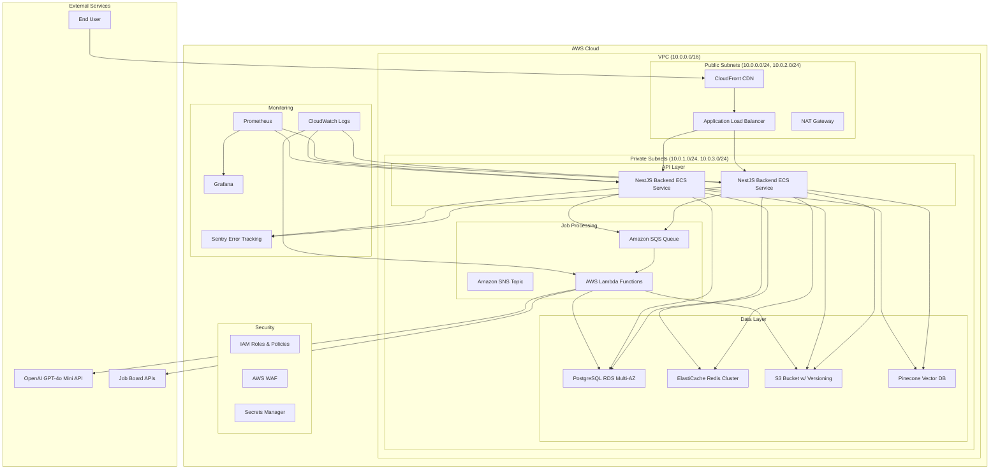

# Apply-as-a-Service V1 Technical Implementation Plan

## 1. Tech Stack Selection

### Frontend
- **Framework**: Next.js 14 (React-based) with App Router
- **Styling**: Tailwind CSS 3.4 for responsive design
- **UI Components**: ShadCN UI library for consistent design system
- **State Management**: React Context API + TanStack Query (for API caching)
- **Form Handling**: React Hook Form + Zod validation
- **Real-time Updates**: Pusher for WebSocket notifications
- **Accessibility**: Radix UI (accessible components) + WCAG 2.1 AA compliance checks
- **Build Tool**: Vite (integrated with Next.js)

### Backend
- **Primary Language**: TypeScript (Node.js 20)
- **API Framework**: NestJS (for structured, scalable backend)
- **Serverless Functions**: AWS Lambda (for async tasks)
- **Message Queue**: AWS SQS + SNS for job processing
- **Caching**: Redis (AWS ElastiCache)
- **Background Processing**: BullMQ (Redis-backed job queue)

### Database
- **Primary Database**: PostgreSQL 15 (AWS RDS)
- **Vector Database**: Pinecone (for semantic search of job roles)
- **Storage**: AWS S3 (for resumes, interview recordings, generated files) with CloudFront CDN
- **ORM**: Prisma (for type-safe database interactions)

### LLM Integration
- **Primary Model**: GPT-4o Mini (OpenAI API)
- **Fallback Model**: Llama 3.1 70B (Groq API for faster inference)
- **Prompt Management**: LangChain or PromptLayer for version control
- **Cost Optimization**: Prompt caching, batch processing, model selection logic

### Job Board Integration
- **APIs**: LinkedIn Jobs API, Indeed API, Glassdoor API
- **Scraping**: Playwright (for sites without APIs) + Scrapy (Python-based)
- **Proxy Rotation**: BrightData or Luminati for anti-blocking

### DevOps & Infrastructure
- **Cloud Provider**: AWS (cost-optimized for 1000 active users)
- **Containerization**: Docker + ECS (Fargate) for microservices
- **Orchestration**: AWS ECS with Service Discovery
- **CI/CD**: GitHub Actions with AWS CodePipeline
- **Monitoring**: Prometheus + Grafana for metrics, CloudWatch for logging
- **Error Tracking**: Sentry
- **Security**: AWS WAF, CloudFront security headers, Secrets Manager

## 2. Database Schema Outline

### User Management
```sql
-- Users table
CREATE TABLE users (
    id UUID PRIMARY KEY,
    email VARCHAR(255) UNIQUE NOT NULL,
    password_hash VARCHAR(255),
    first_name VARCHAR(100) NOT NULL,
    last_name VARCHAR(100) NOT NULL,
    avatar_url TEXT,
    onboarding_completed BOOLEAN DEFAULT FALSE,
    created_at TIMESTAMP WITH TIME ZONE DEFAULT NOW(),
    updated_at TIMESTAMP WITH TIME ZONE DEFAULT NOW()
);

-- User preferences
CREATE TABLE user_preferences (
    id UUID PRIMARY KEY,
    user_id UUID REFERENCES users(id) ON DELETE CASCADE,
    job_title VARCHAR(255) NOT NULL,
    location VARCHAR(255),
    remote_preference VARCHAR(50), -- 'remote', 'hybrid', 'onsite'
    job_types VARCHAR(255)[], -- ['full_time', 'part_time', 'contract']
    min_salary INTEGER,
    max_salary INTEGER,
    industries VARCHAR(255)[],
    skill_keywords VARCHAR(255)[],
    created_at TIMESTAMP WITH TIME ZONE DEFAULT NOW(),
    updated_at TIMESTAMP WITH TIME ZONE DEFAULT NOW()
);
```

### Profile Management
```sql
-- Canonical candidate profiles
CREATE TABLE candidate_profiles (
    id UUID PRIMARY KEY,
    user_id UUID REFERENCES users(id) ON DELETE CASCADE,
    headline VARCHAR(255),
    summary TEXT,
    experiences JSONB, -- Array of experience objects
    education JSONB, -- Array of education objects
    skills JSONB, -- Array of skills with proficiency levels
    certifications JSONB, -- Array of certifications
    projects JSONB, -- Array of project objects
    languages JSONB, -- Array of languages with proficiency
    created_at TIMESTAMP WITH TIME ZONE DEFAULT NOW(),
    updated_at TIMESTAMP WITH TIME ZONE DEFAULT NOW()
);

-- Resume versions
CREATE TABLE resumes (
    id UUID PRIMARY KEY,
    user_id UUID REFERENCES users(id) ON DELETE CASCADE,
    file_url TEXT NOT NULL,
    file_size INTEGER,
    parsed_data JSONB,
    is_primary BOOLEAN DEFAULT FALSE,
    created_at TIMESTAMP WITH TIME ZONE DEFAULT NOW()
);
```

### Role & Application Management
```sql
-- Job roles discovered
CREATE TABLE job_roles (
    id UUID PRIMARY KEY,
    title VARCHAR(255) NOT NULL,
    company VARCHAR(255) NOT NULL,
    location VARCHAR(255),
    remote_type VARCHAR(50),
    job_type VARCHAR(50),
    salary_range JSONB, -- { min: number, max: number, currency: string }
    description TEXT,
    requirements TEXT,
    posted_date TIMESTAMP WITH TIME ZONE,
    url TEXT NOT NULL,
    source VARCHAR(50) NOT NULL, -- 'linkedin', 'indeed', 'glassdoor', etc.
    salary_source VARCHAR(50),
    normalized_title VARCHAR(255),
    created_at TIMESTAMP WITH TIME ZONE DEFAULT NOW(),
    updated_at TIMESTAMP WITH TIME ZONE DEFAULT NOW()
);

-- User role matches
CREATE TABLE role_matches (
    id UUID PRIMARY KEY,
    user_id UUID REFERENCES users(id) ON DELETE CASCADE,
    job_role_id UUID REFERENCES job_roles(id) ON DELETE CASCADE,
    match_score INTEGER NOT NULL, -- 0-100
    matched_skills JSONB, -- Array of matching skills
    missing_skills JSONB, -- Array of required skills not in profile
    role_scoring_data JSONB, -- Detailed scoring breakdown
    applied BOOLEAN DEFAULT FALSE,
    created_at TIMESTAMP WITH TIME ZONE DEFAULT NOW(),
    updated_at TIMESTAMP WITH TIME ZONE DEFAULT NOW()
);

-- Generated resumes for specific roles
CREATE TABLE tailored_resumes (
    id UUID PRIMARY KEY,
    user_id UUID REFERENCES users(id) ON DELETE CASCADE,
    job_role_id UUID REFERENCES job_roles(id) ON DELETE CASCADE,
    original_resume_id UUID REFERENCES resumes(id) ON DELETE CASCADE,
    file_url TEXT NOT NULL,
    generated_at TIMESTAMP WITH TIME ZONE DEFAULT NOW()
);
```

### Application Tracking
```sql
-- Application submissions
CREATE TABLE applications (
    id UUID PRIMARY KEY,
    user_id UUID REFERENCES users(id) ON DELETE CASCADE,
    job_role_id UUID REFERENCES job_roles(id) ON DELETE CASCADE,
    tailored_resume_id UUID REFERENCES tailored_resumes(id),
    status VARCHAR(50) NOT NULL DEFAULT 'pending', -- 'pending', 'submitted', 'failed', 'rejected'
    submission_url TEXT,
    submission_data JSONB, -- Form data submitted
    fail_reason TEXT,
    anti_spam_score INTEGER, -- 0-100
    created_at TIMESTAMP WITH TIME ZONE DEFAULT NOW(),
    updated_at TIMESTAMP WITH TIME ZONE DEFAULT NOW()
);

-- Application history
CREATE TABLE application_history (
    id UUID PRIMARY KEY,
    application_id UUID REFERENCES applications(id) ON DELETE CASCADE,
    status VARCHAR(50) NOT NULL,
    status_change_date TIMESTAMP WITH TIME ZONE DEFAULT NOW(),
    notes TEXT
);
```

### Interview Management
```sql
-- Conversational interviews
CREATE TABLE interviews (
    id UUID PRIMARY KEY,
    user_id UUID REFERENCES users(id) ON DELETE CASCADE,
    type VARCHAR(50) NOT NULL, -- 'profile_enhancement', 'role_specific'
    transcript TEXT,
    insights JSONB, -- Extracted skills, experiences, preferences
    completed BOOLEAN DEFAULT FALSE,
    started_at TIMESTAMP WITH TIME ZONE DEFAULT NOW(),
    completed_at TIMESTAMP WITH TIME ZONE
);

-- Interview questions and answers
CREATE TABLE interview_questions (
    id UUID PRIMARY KEY,
    interview_id UUID REFERENCES interviews(id) ON DELETE CASCADE,
    question_text TEXT NOT NULL,
    answer_text TEXT,
    question_order INTEGER,
    created_at TIMESTAMP WITH TIME ZONE DEFAULT NOW()
);
```

### Audit & Compliance
```sql
-- Audit logs for all actions
CREATE TABLE audit_logs (
    id UUID PRIMARY KEY,
    user_id UUID REFERENCES users(id) ON DELETE CASCADE,
    action VARCHAR(255) NOT NULL,
    resource_type VARCHAR(255),
    resource_id UUID,
    details JSONB,
    ip_address INET,
    user_agent TEXT,
    created_at TIMESTAMP WITH TIME ZONE DEFAULT NOW()
);
```

## 3. API Endpoints Design

### Authentication & User Management
| Endpoint | Method | Description | Auth Required |
|----------|--------|-------------|----------------|
| `/api/auth/signup` | POST | Create new user account | No |
| `/api/auth/login` | POST | User login (returns JWT) | No |
| `/api/auth/logout` | POST | Invalidate current session | Yes |
| `/api/auth/reset-password` | POST | Send password reset email | No |
| `/api/users/me` | GET | Get current user profile | Yes |
| `/api/users/me` | PUT | Update user profile | Yes |
| `/api/users/me/preferences` | GET | Get user preferences | Yes |
| `/api/users/me/preferences` | PUT | Update user preferences | Yes |

### Profile Management
| Endpoint | Method | Description | Auth Required |
|----------|--------|-------------|----------------|
| `/api/profiles/me` | GET | Get user's canonical profile | Yes |
| `/api/profiles/me` | PUT | Update canonical profile | Yes |
| `/api/resumes` | POST | Upload new resume | Yes |
| `/api/resumes` | GET | List user's resumes | Yes |
| `/api/resumes/:id` | GET | Get specific resume | Yes |
| `/api/resumes/:id` | DELETE | Delete resume | Yes |
| `/api/resumes/:id/parse` | POST | Parse resume for structured data | Yes |

### Interview Management
| Endpoint | Method | Description | Auth Required |
|----------|--------|-------------|----------------|
| `/api/interviews` | POST | Create new interview session | Yes |
| `/api/interviews/:id` | GET | Get interview details | Yes |
| `/api/interviews/:id/questions` | GET | Get interview questions | Yes |
| `/api/interviews/:id/answers` | POST | Submit interview answers | Yes |
| `/api/interviews/:id/complete` | POST | Complete interview and process insights | Yes |

### Role Discovery & Matching
| Endpoint | Method | Description | Auth Required |
|----------|--------|-------------|----------------|
| `/api/roles/discover` | POST | Trigger role discovery for user | Yes |
| `/api/roles/matches` | GET | List matched roles for user | Yes |
| `/api/roles/matches/:id` | GET | Get specific role match details | Yes |
| `/api/roles/matches/:id/apply` | POST | Apply to a matched role | Yes |
| `/api/roles/matches/:id/ignore` | POST | Ignore a matched role | Yes |

### Application Tracking
| Endpoint | Method | Description | Auth Required |
|----------|--------|-------------|----------------|
| `/api/applications` | GET | List user's applications | Yes |
| `/api/applications/:id` | GET | Get application details | Yes |
| `/api/applications/:id/status` | PUT | Update application status | Yes |
| `/api/applications/:id/notes` | POST | Add notes to application | Yes |

### Admin & Analytics
| Endpoint | Method | Description | Auth Required | Role |
|----------|--------|-------------|----------------|------|
| `/api/admin/users` | GET | List all users | Yes | Admin |
| `/api/admin/roles` | GET | List all job roles | Yes | Admin |
| `/api/admin/applications` | GET | List all applications | Yes | Admin |
| `/api/admin/analytics` | GET | Get platform-wide analytics | Yes | Admin |

## 4. Deployment Architecture

### AWS Infrastructure Diagram


### Key Infrastructure Components
- **VPC**: 10.0.0.0/16 CIDR with public and private subnets across 2 AZs for high availability
- **Load Balancing**: Application Load Balancer with SSL termination
- **Compute**: ECS Fargate services with auto-scaling
- **Database**: RDS PostgreSQL Multi-AZ with read replica
- **Caching**: ElastiCache Redis cluster (2 nodes)
- **Storage**: S3 bucket with versioning and lifecycle policies
- **Security**: WAF with rate limiting, IAM role-based access, Secrets Manager for credentials
- **Monitoring**: CloudWatch for logs, Prometheus/Grafana for metrics, Sentry for errors

## 5. CI/CD Pipeline

### GitHub Actions Workflow
```yaml
name: CI/CD Pipeline

on:
  push:
    branches: [ main, develop ]
  pull_request:
    branches: [ main, develop ]

jobs:
  lint:
    runs-on: ubuntu-latest
    steps:
      - uses: actions/checkout@v4
      - uses: actions/setup-node@v4
        with:
          node-version: '20'
          cache: 'npm'
      - run: npm ci
      - run: npm run lint
      - run: npm run type-check

  test:
    runs-on: ubuntu-latest
    needs: lint
    services:
      postgres:
        image: postgres:15
        ports: [ '5432:5432' ]
        env:
          POSTGRES_PASSWORD: postgres
      redis:
        image: redis:7
        ports: [ '6379:6379' ]
    steps:
      - uses: actions/checkout@v4
      - uses: actions/setup-node@v4
        with:
          node-version: '20'
          cache: 'npm'
      - run: npm ci
      - run: npm run test:unit
      - run: npm run test:integration

  build:
    runs-on: ubuntu-latest
    needs: test
    steps:
      - uses: actions/checkout@v4
      - uses: actions/setup-node@v4
        with:
          node-version: '20'
          cache: 'npm'
      - run: npm ci
      - run: npm run build
      - uses: docker/login-action@v3
        with:
          username: ${{ secrets.DOCKER_USERNAME }}
          password: ${{ secrets.DOCKER_PASSWORD }}
      - uses: docker/build-push-action@v5
        with:
          context: .
          push: true
          tags: |
            ${{ secrets.DOCKER_REPO }}/aas-api:${{ github.sha }}
            ${{ secrets.DOCKER_REPO }}/aas-api:${{ github.ref == 'refs/heads/main' && 'latest' || 'develop' }}

  deploy:
    runs-on: ubuntu-latest
    needs: build
    environment: ${{ github.ref == 'refs/heads/main' && 'production' || 'staging' }}
    steps:
      - uses: actions/checkout@v4
      - uses: aws-actions/configure-aws-credentials@v4
        with:
          aws-access-key-id: ${{ secrets.AWS_ACCESS_KEY_ID }}
          aws-secret-access-key: ${{ secrets.AWS_SECRET_ACCESS_KEY }}
          aws-region: us-east-1
      - run: |
          aws ecs update-service \
            --cluster ${{ secrets.ECS_CLUSTER }} \
            --service ${{ secrets.ECS_SERVICE }} \
            --force-new-deployment \
            --task-definition ${{ secrets.ECS_TASK_DEFINITION }}
```

### Pipeline Stages
1. **Lint & Type Check**: Validate code quality and type safety
2. **Testing**: Run unit and integration tests with PostgreSQL and Redis services
3. **Build**: Create Docker image and push to Docker Hub
4. **Deploy**: Update ECS service with new task definition

### Environments
- **Development**: Local Docker environment with hot reloading
- **Staging**: Separate AWS environment for QA testing
- **Production**: Main AWS environment with auto-scaling

## 6. Sprint-by-Sprint Implementation Timeline

### Sprint 1 (Weeks 1-2) - Foundation & Core Services
- **Infrastructure Setup**: Provision AWS VPC, ECS cluster, RDS, ElastiCache
- **CI/CD Pipeline**: Set up GitHub Actions workflow
- **Authentication**: Implement JWT-based authentication with refresh tokens
- **User Management**: Create user profiles and preferences API
- **Database**: Set up Prisma ORM and initial schema
- **Frontend**: Create landing page and onboarding flow

### Sprint 2 (Weeks 3-4) - Profile & Interview
- **Resume Parser**: Integrate with ResumeParser API
- **Profile Builder**: Implement canonical profile management
- **Conversational Interview**: Build interview interface and API
- **Frontend**: Create profile dashboard and interview UI
- **Role Discovery**: Basic LinkedIn API integration

### Sprint 3 (Weeks 5-6) - Role Matching & Scoring
- **Role Discovery Engine**: Add Indeed and Glassdoor API integration
- **Role Matching**: Implement scoring algorithm based on skills and preferences
- **Vector Search**: Integrate Pinecone for semantic role search
- **Frontend**: Create role matching results UI with filters

### Sprint 4 (Weeks 7-8) - Application Processing
- **Resume Tailor**: Integrate GPT-4o Mini for resume customization
- **Application Submission**: Build browser automation with Playwright
- **Anti-Spam Guardrails**: Implement CAPTCHA solving and rate limiting
- **Job Queue**: Set up SQS + Lambda for async application processing
- **Frontend**: Create application tracking dashboard

### Sprint 5 (Weeks 9-10) - Optimization & Security
- **LLM Cost Optimization**: Implement prompt caching and batch processing
- **Performance**: Add Redis caching for frequent queries
- **Security**: Enable WAF, CloudFront security headers, and encryption
- **Compliance**: Add audit logging and user consent management
- **Monitoring**: Set up Prometheus/Grafana and CloudWatch

### Sprint 6 (Weeks 11-12) - Testing & Launch
- **User Acceptance Testing (UAT)**: Beta testing with 50-100 users
- **Bug Fixes**: Address issues from UAT and automated tests
- **Documentation**: Create API docs and user guides
- **Performance Tuning**: Optimize auto-scaling and resource allocation
- **Launch Preparation**: Final security audit and performance testing

## 7. Testing Strategy

### Test Types
- **Unit Tests**: Test individual functions and components (Jest + React Testing Library)
- **Integration Tests**: Test API endpoints and database interactions (Supertest + Prisma)
- **E2E Tests**: Test user flows with browser automation (Playwright)
- **Performance Tests**: Load testing with k6, stress testing with Locust
- **Security Tests**: Vulnerability scanning with OWASP ZAP, dependency checks

### Test Coverage Targets
- Unit tests: 80% coverage
- Integration tests: 60% coverage
- E2E tests: 40% coverage

### Test Environments
- **Development**: Local testing with Docker containers
- **Staging**: Full-scale testing with production-like data
- **Production**: Canary deployments with 10% traffic

### Testing Process
1. Developers write tests for new features
2. CI pipeline runs all tests on every PR
3. QA team performs manual testing on staging
4. Performance and security tests weekly
5. Post-deployment monitoring and testing

## 8. Cost Optimization Strategy

### LLM Cost Control
- **Model Selection**: Use GPT-4o Mini ($0.15/1M tokens) for most tasks, Llama 3.1 70B for complex parsing
- **Prompt Caching**: Cache similar prompts using Redis
- **Batch Processing**: Process multiple resume tailor requests in batches
- **Token Reduction**: Optimize prompts to use fewer tokens

### Infrastructure Cost Control
- **Serverless Architecture**: Use Lambda for async tasks with pay-per-use pricing
- **Auto-Scaling**: ECS Fargate with scheduled scaling based on usage patterns
- **Reserved Instances**: RDS and ElastiCache with reserved instances for base load
- **Data Lifecycle**: S3 lifecycle policies to archive stale data after 12 months

### Data Transfer Optimization
- **CDN**: CloudFront with caching for static content
- **API Caching**: Redis for frequently accessed API responses
- **Compression**: Gzip and Brotli compression for API responses

### Cost Monitoring
- **AWS Cost Explorer**: Set up daily and monthly cost reports
- **Budget Alerts**: Configure alerts for cost thresholds
- **Resource Tagging**: Tag all resources for cost allocation

## 9. Security & Compliance

### Data Protection
- **Encryption**: AES-256 at rest, TLS 1.3 in transit
- **Access Control**: IAM roles with least-privilege permissions
- **Secrets Management**: AWS Secrets Manager for credentials
- **Network Security**: VPC security groups and network ACLs

### Compliance
- **GDPR/CCPA**: User consent management, data subject rights
- **Audit Logs**: Centralized logging with CloudWatch
- **Vulnerability Scanning**: AWS Inspector for EC2 instances

### Anti-Spam Measures
- **CAPTCHA Solving**: Integration with 2Captcha or Anti-Captcha
- **Rate Limiting**: AWS WAF with IP-based rate limiting
- **Proxy Rotation**: BrightData for rotating IP addresses

## 10. Success Metrics Tracking

### Core Metrics
- **Application Submission Rate**: 80% of matched roles result in successful submissions
- **Profile Completeness**: 95% of profiles with core sections
- **Time to First Application**: < 30 minutes from profile creation
- **Cost per Active User**: < $5/month at 1000 active users

### Operational Metrics
- **API Response Time**: < 200ms for most endpoints
- **Error Rate**: < 0.5% of requests
- **Uptime**: 99.5% availability

### Business Metrics
- **User Retention**: 70% active after 30 days
- **Application Quality Score**: 85/100 average
- **Role Match Accuracy**: 80% of applied roles rated as relevant

This implementation plan provides a comprehensive guide to building the Apply-as-a-Service V1 platform with a focus on scalability, cost efficiency, and security. The architecture leverages cloud-native technologies and AI to deliver an automated job application experience while maintaining strict cost controls.
