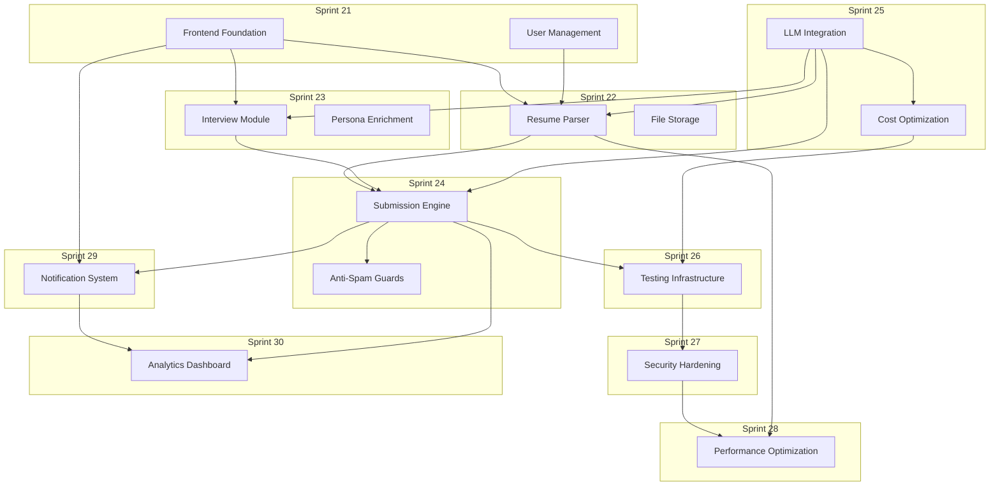

# Apply-as-a-Service Sprints 21-30: Comprehensive Implementation Plan

## Executive Summary

This document outlines the next 10 sprints of work for the Apply-as-a-Service platform. Based on a thorough analysis of the codebase, we've identified critical gaps that must be addressed to deliver a production-ready, end-to-end job application automation platform. The plan prioritizes foundational features that enable the core workflow: resume parsing → profile building → role discovery → matching → tailoring → application submission.

### Current State Assessment

**Strengths:**
- Comprehensive NestJS backend architecture with 50+ entities
- Well-structured modules: Auth, Profile, Job Ingestion, Application, Automation, Notification, Intake, Matching, Tailoring, Orchestrator, Monitoring, Feedback, Career, Outreach, Performance, Security
- Strong matching algorithm with configurable weights and validation
- Application state machine for workflow management
- Monitoring and observability foundation in place
- Good documentation practices with sprint snapshots

**Critical Gaps:**
1. No frontend implementation (Next.js mentioned but not present)
2. No UserModule service implementation
3. No Resume Parser service
4. No LLM Integration service
5. Conversational Interview Module incomplete
6. Application Submission Engine partial (state transitions only, no actual submission)
7. Anti-Spam Guardrail System incomplete
8. No testing infrastructure beyond basic spec files
9. No file storage integration (S3/cloud storage)
10. No email/notification delivery system
11. Rate limiting not fully integrated at API level
12. Security module needs strengthening
13. No caching strategy implemented
14. API documentation incomplete
15. No comprehensive error handling framework

---

## Sprint 21: Frontend Foundation & User Management

**Duration:** 2 weeks
**Priority:** P0 - Critical Foundation
**Dependencies:** None

### Goals
Establish the frontend foundation with Next.js 14, implement user management, and create the core UI components that will support all user-facing features.

### Deliverables

#### 1. Next.js Frontend Setup
- [ ] Initialize Next.js 14 project with TypeScript
- [ ] Configure Tailwind CSS and ShadCN UI library
- [ ] Set up ESLint, Prettier, and Husky for code quality
- [ ] Configure environment variables and build scripts
- [ ] Set up API client with Axios and interceptors
- [ ] Implement error boundary and global error handling

#### 2. Authentication UI
- [ ] Create login page with email/password form
- [ ] Create signup page with registration flow
- [ ] Implement password reset flow
- [ ] Add JWT token management and refresh logic
- [ ] Create protected route wrapper component
- [ ] Implement logout and session management

#### 3. User Management Module
- [ ] Implement UserModule service (backend)
- [ ] Create user profile page with edit functionality
- [ ] Implement account settings page
- [ ] Add password change functionality
- [ ] Implement account deletion with confirmation
- [ ] Create user avatar upload component

#### 4. Core UI Components
- [ ] Design system tokens (colors, typography, spacing)
- [ ] Button, Input, Select, Checkbox components
- [ ] Modal/Dialog component
- [ ] Toast notification system
- [ ] Loading spinner and skeleton components
- [ ] Form validation with Zod integration

#### 5. Navigation and Layout
- [ ] Main layout with sidebar navigation
- [ ] Header with user menu and notifications
- [ ] Breadcrumb navigation
- [ ] Mobile-responsive navigation menu
- [ ] 404 and error pages

### API Endpoints Required
```
POST /auth/login
POST /auth/signup
POST /auth/refresh-token
POST /auth/forgot-password
POST /auth/reset-password

GET /user/profile
PUT /user/profile
PUT /user/password
DELETE /user/account
```

### Technical Considerations
- Use Next.js App Router for server components
- Implement proper SSR for protected pages
- Use React Query for data fetching and caching
- Maintain WCAG 2.1 AA accessibility standards
- Implement responsive design for mobile/tablet/desktop

---

## Sprint 22: Resume Parser & Document Processing

**Duration:** 2 weeks
**Priority:** P0 - Core Functionality
**Dependencies:** Sprint 21

### Goals
Implement a robust resume parser that extracts structured data from various resume formats, integrates with file storage, and feeds into the profile building pipeline.

### Deliverables

#### 1. Resume Parser Service (Backend)
- [ ] Create ResumeParserService with PDF extraction
- [ ] Implement DOCX parsing support
- [ ] Add plain text resume parsing
- [ ] Create skill extraction algorithm
- [ ] Implement experience and education extraction
- [ ] Add contact information extraction
- [ ] Create confidence scoring for extracted data

#### 2. File Storage Integration
- [ ] Implement AWS S3 integration for resume storage
- [ ] Create file upload API endpoint
- [ ] Add file validation (type, size, virus scan placeholder)
- [ ] Implement secure file URLs with expiration
- [ ] Create file cleanup job for orphaned files
- [ ] Add file metadata tracking

#### 3. Resume Entity Enhancements
- [ ] Add extractedSkills field to Resume entity
- [ ] Add parsedExperience field (JSON)
- [ ] Add parsedEducation field (JSON)
- [ ] Add parsingConfidenceScore field
- [ ] Add version tracking for re-parsing

#### 4. Resume Management UI
- [ ] Create resume upload page
- [ ] Implement drag-and-drop file upload
- [ ] Create resume list view
- [ ] Add resume preview functionality
- [ ] Implement resume delete with confirmation
- [ ] Add resume download capability

#### 5. Error Handling and Validation
- [ ] Create structured error responses for parsing failures
- [ ] Add fallback parsing strategies
- [ ] Implement retry logic for failed parses
- [ ] Add parsing failure alerting

### API Endpoints
```
POST /resume/upload
GET /resume/list
GET /resume/:id
GET /resume/:id/download
DELETE /resume/:id
POST /resume/:id/reparse
```

### Technical Considerations
- Use PDF.js for PDF text extraction
- Implement mammoth.js for DOCX parsing
- Store raw resume for re-parsing capability
- Consider unstructured-to-structured conversion pipeline
- Add support for multiple resume versions per user

---

## Sprint 23: Conversational Interview Module

**Duration:** 2 weeks
**Priority:** P0 - Core Functionality
**Dependencies:** Sprint 21

### Goals
Implement a complete conversational interview system that extracts nuanced skills and experiences that generic resume parsers miss, creating rich persona data.

### Deliverables

#### 1. Interview Flow Engine
- [ ] Create InterviewSessionService
- [ ] Implement multi-step interview wizard
- [ ] Add question randomization and adaptive difficulty
- [ ] Create conversation state management
- [ ] Implement interview pause/resume functionality
- [ ] Add interview timeout handling

#### 2. Question Bank
- [ ] Create structured question database
- [ ] Implement question categories (behavioral, technical, situational)
- [ ] Add role-specific question sets
- [ ] Create follow-up question logic
- [ ] Implement dynamic question generation based on responses

#### 3. Answer Processing
- [ ] Implement LLM-powered answer analysis
- [ ] Create skill extraction from answers
- [ ] Add experience extraction logic
- [ ] Implement sentiment analysis for tone
- [ ] Create answer quality scoring

#### 4. Persona Enrichment
- [ ] Create PersonaEnrichmentService
- [ ] Merge resume data with interview insights
- [ ] Add soft skills extraction
- [ ] Implement work style assessment
- [ ] Create communication style mapping

#### 5. Interview UI
- [ ] Create conversational interview interface
- [ ] Implement voice-to-text input option
- [ ] Add text input with autocomplete
- [ ] Create progress indicator
- [ ] Implement saveDraft functionality

### API Endpoints
```
POST /interview/start
POST /interview/:id/question
POST /interview/:id/answer
POST /interview/:id/pause
POST /interview/:id/resume
POST /interview/:id/complete
GET /interview/:id/results
```

### Technical Considerations
- Use Web Speech API for voice input
- Implement debouncing for text input
- Consider streaming responses for LLM analysis
- Add offline support with localStorage
- Implement proper session timeout handling

---

## Sprint 24: Application Submission Engine

**Duration:** 2 weeks
**Priority:** P0 - Core Functionality
**Dependencies:** Sprint 22, Sprint 23

### Goals
Implement the actual application submission engine that delivers tailored applications to job boards and ATS systems, completing the automation pipeline.

### Deliverables

#### 1. ATS Integration Framework
- [ ] Create ATSApplicationService
- [ ] Implement Greenhouse integration
- [ ] Implement Lever integration
- [ ] Implement Workday integration
- [ ] Create generic ATS adapter pattern

#### 2. Application Form Automation
- [ ] Create FormAutomationService
- [ ] Implement form field detection algorithm
- [ ] Add field value mapping system
- [ ] Create CAPTCHA handling strategy
- [ ] Implement file upload automation

#### 3. Application Queue System
- [ ] Create ApplicationQueueService (Bull/BullMQ)
- [ ] Implement priority queuing based on user preferences
- [ ] Add rate limiting per job board
- [ ] Create retry logic with exponential backoff
- [ ] Implement dead letter queue for failed applications

#### 4. Submission Tracking
- [ ] Enhance Application entity with submission tracking
- [ ] Add submission status field
- [ ] Implement submission confirmation detection
- [ ] Create submission history audit log
- [ ] Add submission failure notification

#### 5. Anti-Spam Guardrails
- [ ] Implement UserAgent rotation
- [ ] Add request fingerprinting
- [ ] Create submission rate limiting per user
- [ ] Implement geographic distribution
- [ ] Add human-in-the-loop verification for high-value applications

### API Endpoints
```
POST /application/submit/:id
GET /application/:id/submission-status
POST /application/:id/retry
GET /application/:id/submission-history
```

### Technical Considerations
- Use Playwright/Puppeteer for form automation
- Implement proxy rotation for request distribution
- Consider headless browser for complex forms
- Add proper error handling for ATS API changes
- Implement compliance checks for automated submissions

---

## Sprint 25: LLM Integration & Cost Optimization

**Duration:** 2 weeks
**Priority:** P1 - Cost Efficiency
**Dependencies:** None

### Goals
Implement a unified LLM integration layer with cost optimization, prompt caching, and model selection to meet the $5/user/month target.

### Deliverables

#### 1. LLM Service Abstraction Layer
- [ ] Create LLMService interface
- [ ] Implement OpenAI GPT-4o Mini provider
- [ ] Implement Anthropic Claude provider (fallback)
- [ ] Create local model provider (Llama 3.1 fallback)
- [ ] Implement provider failover logic

#### 2. Prompt Management
- [ ] Create PromptTemplateService
- [ ] Implement prompt versioning
- [ ] Add prompt A/B testing framework
- [ ] Create prompt performance metrics
- [ ] Implement prompt template CRUD operations

#### 3. Cost Optimization Engine
- [ ] Create CostTrackingService
- [ ] Implement prompt caching strategy
- [ ] Add batch processing for cost reduction
- [ ] Create cost预算 enforcement per user
- [ ] Implement model selection based on task complexity

#### 4. Response Caching
- [ ] Create SemanticCacheService using vector similarity
- [ ] Implement cache invalidation policies
- [ ] Add cache hit/miss metrics
- [ ] Create cache warming strategy

#### 5. Usage Analytics
- [ ] Create LLM usage dashboard
- [ ] Implement cost per user tracking
- [ ] Add model usage breakdown
- [ ] Create cost anomaly detection
- [ ] Implement usage reporting

### API Endpoints
```
POST /llm/generate
POST /llm/generate/batch
GET /llm/usage
GET /llm/cost/:userId
PUT /llm/cost-limit/:userId
GET /llm/prompts
POST /llm/prompts
```

### Technical Considerations
- Use Redis for caching and rate limiting
- Implement semantic search for cache hits
- Consider function calling for structured outputs
- Add proper timeout handling
- Implement graceful degradation

---

## Sprint 26: Testing Infrastructure & Quality Assurance

**Duration:** 2 weeks
**Priority:** P1 - Quality
**Dependencies:** Sprint 24, Sprint 25

### Goals
Establish comprehensive testing infrastructure to ensure reliability, catch regressions, and enable confident deployments.

### Deliverables

#### 1. Unit Testing Framework
- [ ] Set up Jest with TypeScript configuration
- [ ] Create test utilities and fixtures
- [ ] Implement mocking strategies for external services
- [ ] Add code coverage reporting (target: 80%)
- [ ] Create test data factories

#### 2. Integration Testing
- [ ] Set up TestContainers for PostgreSQL testing
- [ ] Create API integration test suite
- [ ] Implement database transaction rollback for tests
- [ ] Add test database seeding
- [ ] Create integration test patterns

#### 3. E2E Testing
- [ ] Set up Playwright for E2E testing
- [ ] Create critical user journey tests
- [ ] Implement visual regression testing
- [ ] Add accessibility testing (axe-core)
- [ ] Create cross-browser testing matrix

#### 4. Contract Testing
- [ ] Set up Pact for consumer-driven contracts
- [ ] Define API contract specifications
- [ ] Implement provider verification
- [ ] Add contract breaking detection

#### 5. Performance Testing
- [ ] Set up k6 for load testing
- [ ] Create baseline performance tests
- [ ] Implement stress testing scenarios
- [ ] Add API response time tracking
- [ ] Create performance regression detection

### Test Coverage Goals
- Unit tests: 80% coverage for business logic
- Integration tests: Critical paths covered
- E2E tests: 20 critical user journeys
- Performance: <500ms p95 API response time

---

## Sprint 27: Security Hardening & Compliance

**Duration:** 2 weeks
**Priority:** P0 - Security
**Dependencies:** None

### Goals
Strengthen security measures, implement compliance requirements, and prepare for external security audits.

### Deliverables

#### 1. Authentication Enhancements
- [ ] Implement MFA (TOTP-based)
- [ ] Add biometric authentication option
- [ ] Create session management improvements
- [ ] Implement device fingerprinting
- [ ] Add suspicious login detection

#### 2. Data Protection
- [ ] Implement field-level encryption for sensitive data
- [ ] Add data anonymization for analytics
- [ ] Create data retention policies
- [ ] Implement GDPR right-to-be-forgotten
- [ ] Add CCPA compliance features

#### 3. API Security
- [ ] Implement API key rotation
- [ ] Add webhook signature verification
- [ ] Create rate limiting per endpoint
- [ ] Implement request validation hardening
- [ ] Add SQL injection and XSS protection

#### 4. Audit and Compliance
- [ ] Create comprehensive audit logging
- [ ] Implement activity tracking
- [ ] Add compliance reporting dashboard
- [ ] Create data export functionality
- [ ] Implement consent management

#### 5. Security Monitoring
- [ ] Enhance threat detection rules
- [ ] Create security incident response流程
- [ ] Add vulnerability scanning
- [ ] Implement penetration testing workflow
- [ ] Create security metrics dashboard

### API Endpoints
```
POST /security/mfa/enable
POST /security/mfa/verify
POST /security/session/revoke
GET /security/audit-log
POST /security/consent
GET /security/export-data
DELETE /security/delete-account
```

---

## Sprint 28: Performance Optimization & Caching

**Duration:** 2 weeks
**Priority:** P1 - Performance
**Dependencies:** Sprint 25, Sprint 26

### Goals
Optimize system performance, implement comprehensive caching, and prepare for scale.

### Deliverables

#### 1. Redis Caching Layer
- [ ] Implement Redis caching for frequently accessed data
- [ ] Create cache invalidation patterns
- [ ] Add session storage in Redis
- [ ] Implement rate limiting with Redis
- [ ] Create cache warming strategy

#### 2. Database Optimization
- [ ] Analyze and optimize slow queries
- [ ] Add composite indexes for common queries
- [ ] Implement query result caching
- [ ] Create read replica setup
- [ ] Implement connection pooling optimization

#### 3. Query Optimization
- [ ] Optimize N+1 query patterns
- [ ] Implement DataLoader pattern
- [ ] Add pagination optimization
- [ ] Create batch loading strategies
- [ ] Implement selective field retrieval

#### 4. Frontend Performance
- [ ] Implement lazy loading for routes
- [ ] Add code splitting
- [ ] Optimize images and assets
- [ ] Implement SSR for critical pages
- [ ] Add performance monitoring (RUM)

#### 5. CDN and Asset Delivery
- [ ] Configure CDN for static assets
- [ ] Implement asset compression
- [ ] Add cache headers optimization
- [ ] Create asset versioning
- [ ] Implement geographic caching

### Performance Targets
- API p95 response time: <300ms
- Page load time: <2s
- Time to interactive: <3s
- Cache hit rate: >80%
- Database query time: <50ms average

---

## Sprint 29: Notification System & Email Delivery

**Duration:** 2 weeks
**Priority:** P2 - User Experience
**Dependencies:** Sprint 21

### Goals
Implement a comprehensive notification system that keeps users informed about application status, matches, and important updates.

### Deliverables

#### 1. Email Infrastructure
- [ ] Set up SendGrid/Resend for email delivery
- [ ] Create email template system
- [ ] Implement transactional email handling
- [ ] Add email analytics (open, click tracking)
- [ ] Create email preference center

#### 2. Notification Channels
- [ ] Implement in-app notification center
- [ ] Add push notification support
- [ ] Create SMS notification option
- [ ] Implement webhook notifications
- [ ] Add Slack integration option

#### 3. Notification Templates
- [ ] Application submitted confirmation
- [ ] Interview scheduled reminder
- [ ] Application status update
- [ ] New match notification
- [ ] Weekly digest email

#### 4. Notification Preferences
- [ ] Create user notification settings page
- [ ] Implement granular preference controls
- [ ] Add notification frequency settings
- [ ] Create quiet hours feature
- [ ] Implement notification batching

#### 5. Delivery Infrastructure
- [ ] Create NotificationQueueService (BullMQ)
- [ ] Implement retry logic for failed deliveries
- [ ] Add delivery status tracking
- [ ] Create notification audit log
- [ ] Implement opt-out handling

### API Endpoints
```
GET /notifications
PUT /notifications/:id/read
DELETE /notifications
GET /notifications/preferences
PUT /notifications/preferences
POST /notifications/test
```

---

## Sprint 30: Analytics Dashboard & Reporting

**Duration:** 2 weeks
**Priority:** P2 - User Value
**Dependencies:** Sprint 24, Sprint 29

### Goals
Provide users with comprehensive analytics about their job search performance and system usage.

### Deliverables

#### 1. User Analytics Dashboard
- [ ] Create application statistics widgets
- [ ] Implement match rate tracking
- [ ] Add response rate analytics
- [ ] Create time-to-hire metrics
- [ ] Implement goal progress tracking

#### 2. Activity Reports
- [ ] Create weekly activity summary
- [ ] Implement monthly reports
- [ ] Add comparison with previous periods
- [ ] Create exportable reports
- [ ] Implement scheduled report delivery

#### 3. Match Quality Analytics
- [ ] Implement match relevance tracking
- [ ] Add user feedback collection
- [ ] Create match accuracy metrics
- [ ] Implement ML model performance tracking
- [ ] Add improvement recommendations

#### 4. Cost Analytics
- [ ] Create LLM cost breakdown by feature
- [ ] Implement per-user cost tracking
- [ ] Add cost trend analysis
- [ ] Create cost optimization suggestions
- [ ] Implement budget alerts

#### 5. Export and Integration
- [ ] Implement PDF report generation
- [ ] Add CSV data export
- [ ] Create Google Sheets integration
- [ ] Implement webhook for data export
- [ ] Add calendar export for interviews

### API Endpoints
```
GET /analytics/dashboard
GET /analytics/applications
GET /analytics/matches
GET /analytics/costs
GET /analytics/export/:type
POST /analytics/reports/schedule
```

---

## Sprint Dependency Graph



## Priority Matrix

| Sprint | Priority | Effort | Value | Risk |
|--------|----------|--------|-------|------|
| 21 | P0 | High | High | Low |
| 22 | P0 | High | High | Medium |
| 23 | P0 | High | High | Medium |
| 24 | P0 | High | High | High |
| 25 | P1 | Medium | High | Medium |
| 26 | P1 | Medium | Medium | Low |
| 27 | P0 | High | High | Medium |
| 28 | P1 | Medium | Medium | Medium |
| 29 | P2 | Medium | Medium | Low |
| 30 | P2 | Medium | Medium | Low |

## Success Metrics

### Core Functionality
- Resume parsing success rate: >95%
- Interview completion rate: >70%
- Application submission success rate: >85%
- Match relevance score: >80%

### Performance
- API response time p95: <300ms
- Page load time: <2s
- Cache hit rate: >80%

### Quality
- Test coverage: >80%
- Production incidents: <2/month
- Error rate: <0.1%

### Cost
- LLM cost per user/month: <$3
- Infrastructure cost per user/month: <$2
- Total cost per user/month: <$5

## Rollout Strategy

### Phase 1: Foundation (Sprints 21-23)
- Deploy frontend with basic auth
- Launch resume parsing
- Roll out interview module to beta users

### Phase 2: Automation (Sprints 24-25)
- Enable application submission
- Launch LLM integration
- Begin A/B testing for optimization

### Phase 3: Quality (Sprints 26-28)
- Strengthen testing
- Harden security
- Optimize performance

### Phase 4: Experience (Sprints 29-30)
- Launch notifications
- Deploy analytics dashboard

## Risk Mitigation

### Technical Risks
- ATS API changes: Maintain abstraction layer, monitor changes
- LLM cost overruns: Strict budget limits, caching, fallback models
- Form automation breakage: Human-in-the-loop verification

### Business Risks
- User adoption: Focus on quick wins and visible value
- Competition: Differentiate on quality and automation
- Compliance: Regular audits, legal review

### Operational Risks
- Scale issues: Load testing, capacity planning
- Data privacy: Encryption, access controls
- Vendor lock-in: Multi-provider strategy
