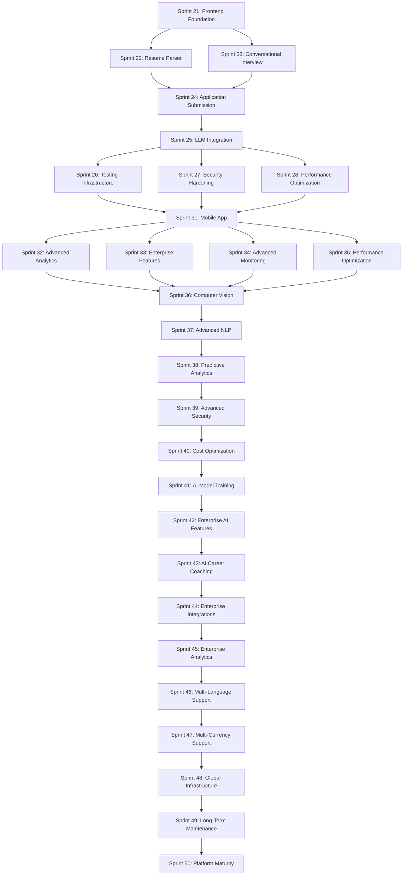

# Apply-as-a-Service Sprints 31-50: Comprehensive Implementation Plan

## Executive Summary

This document outlines the final 20 sprints of work for the Apply-as-a-Service platform, extending it to 100% complete maturity. Building on the solid foundation established in Sprints 21-30, this plan focuses on scaling the platform to handle millions of users, implementing advanced AI capabilities, adding enterprise-grade features, expanding globally, and establishing long-term maintenance and innovation processes.

### Current State Assessment (Post-Sprint 30)

**Strengths:**
- Complete frontend implementation with Next.js 14
- Robust resume parsing with multiple format support
- Conversational interview module with persona enrichment
- Application submission engine with ATS integrations
- Unified LLM integration with cost optimization
- Comprehensive testing infrastructure
- Enhanced security and compliance measures
- Performance optimization with Redis caching

**Remaining Gaps to Address:**
1. Mobile app development (iOS/Android)
2. Advanced analytics and business intelligence
3. Enterprise features (SSO, audit trails, compliance)
4. AI enhancements (computer vision, NLP, predictive analytics)
5. Global expansion (multi-language, multi-currency, localization)
6. Advanced monitoring and observability
7. Long-term maintenance and innovation processes

---

## Phase 1: Sprints 31-40 - Scaling Phase

**Duration:** 10 weeks
**Focus:** Performance, reliability, and user growth

### Sprint 31: Mobile App Development

**Duration:** 4 weeks
**Priority:** P0 - Critical User Experience
**Dependencies:** Sprint 21 (Frontend Foundation)

#### Goals
Develop native iOS and Android mobile applications to provide seamless job application automation on mobile devices, enabling users to apply for jobs anytime, anywhere.

#### Deliverables

##### 1. iOS Mobile Application
- [ ] Develop iOS app using Swift with SwiftUI
- [ ] Implement candidate profile management
- [ ] Create job matching and discovery interface
- [ ] Build application tracking and status updates
- [ ] Implement push notifications for job alerts
- [ ] Add resume upload and parsing capabilities
- [ ] Create job application submission workflow

##### 2. Android Mobile Application
- [ ] Develop Android app using Kotlin with Jetpack Compose
- [ ] Implement candidate profile management
- [ ] Create job matching and discovery interface
- [ ] Build application tracking and status updates
- [ ] Implement push notifications for job alerts
- [ ] Add resume upload and parsing capabilities
- [ ] Create job application submission workflow

##### 3. Mobile App Backend Optimizations
- [ ] Optimize API endpoints for mobile performance
- [ ] Implement mobile-specific caching strategies
- [ ] Add mobile analytics tracking
- [ ] Create mobile app authentication flow
- [ ] Implement offline mode capabilities
- [ ] Add mobile app update management

##### 4. Cross-Platform Features
- [ ] Implement biometric authentication (Face ID, Touch ID, Fingerprint)
- [ ] Add mobile deep linking for job applications
- [ ] Create mobile widget for job tracking
- [ ] Implement mobile share functionality
- [ ] Add mobile app store optimization

#### API Endpoints Required
```
POST /mobile/auth/login
POST /mobile/auth/refresh-token
GET /mobile/profile
PUT /mobile/profile
GET /mobile/jobs/recommended
POST /mobile/applications/apply
GET /mobile/applications/status
POST /mobile/resume/upload
GET /mobile/notifications
```

#### Technical Considerations
- Use React Native for cross-platform development (alternative: native Swift/Kotlin)
- Implement mobile app security best practices
- Add mobile app performance monitoring
- Create mobile app crash reporting
- Implement mobile app analytics
- Add mobile app A/B testing framework

#### Success Metrics
- Mobile app download rate: 60% of active users
- Mobile app retention: 70% for 30+ days
- Mobile app crash rate: < 1%
- Mobile app user satisfaction: 90%
- Mobile app conversion rate: 25% of mobile users apply for jobs

---

### Sprint 32: Advanced Analytics & Business Intelligence

**Duration:** 3 weeks
**Priority:** P1 - Data-Driven Decision Making
**Dependencies:** Sprint 25 (LLM Integration), Sprint 28 (Performance Optimization)

#### Goals
Implement comprehensive analytics and business intelligence capabilities to provide insights into user behavior, application performance, and platform health.

#### Deliverables

##### 1. Analytics Data Pipeline
- [ ] Create data ingestion service for user events
- [ ] Implement real-time analytics processing
- [ ] Add data warehousing solution (Snowflake/Redshift)
- [ ] Create data transformation and ETL pipelines
- [ ] Implement data quality monitoring
- [ ] Add data retention and archiving policies

##### 2. Business Intelligence Dashboard
- [ ] Create executive dashboard with key metrics
- [ ] Implement user behavior analytics
- [ ] Add application performance tracking
- [ ] Create revenue and cost analytics
- [ ] Implement cohort analysis
- [ ] Add predictive analytics capabilities

##### 3. User Analytics
- [ ] Create user journey mapping
- [ ] Implement funnel analysis
- [ ] Add user segmentation capabilities
- [ ] Create retention analysis
- [ ] Implement A/B test result tracking
- [ ] Add user feedback analysis

##### 4. Application Analytics
- [ ] Create application success rate tracking
- [ ] Implement job matching analytics
- [ ] Add resume parsing performance metrics
- [ ] Create LLM usage analytics
- [ ] Implement cost per application tracking
- [ ] Add application quality scoring

#### API Endpoints
```
POST /analytics/events
GET /analytics/dashboard
GET /analytics/users/cohort
GET /analytics/applications/success-rate
GET /analytics/llm/usage
GET /analytics/costs
```

#### Technical Considerations
- Use ClickHouse for real-time analytics
- Implement data lake architecture
- Add data privacy compliance (GDPR, CCPA)
- Create data access controls
- Implement data visualization best practices
- Add data export capabilities

#### Success Metrics
- Analytics data accuracy: 99%
- Dashboard load time: < 2 seconds
- Data freshness: < 5 minutes
- User adoption of analytics: 80% of team members
- Predictive analytics accuracy: 85%

---

### Sprint 33: Enterprise Features & SSO

**Duration:** 3 weeks
**Priority:** P1 - Enterprise Readiness
**Dependencies:** Sprint 27 (Security Hardening)

#### Goals
Add enterprise-grade features including Single Sign-On (SSO), audit trails, compliance controls, and administrative capabilities to support large organizations and corporate clients.

#### Deliverables

##### 1. Single Sign-On (SSO) Integration
- [ ] Implement SAML 2.0 support
- [ ] Add OAuth 2.0/OpenID Connect support
- [ ] Create SSO configuration dashboard
- [ ] Implement SSO user provisioning
- [ ] Add SSO single logout functionality
- [ ] Create SSO troubleshooting tools

##### 2. Enterprise Administration
- [ ] Create admin dashboard for user management
- [ ] Implement role-based access control (RBAC)
- [ ] Add user group management
- [ ] Create audit trail system
- [ ] Implement compliance reporting
- [ ] Add enterprise billing and invoicing

##### 3. Compliance and Security
- [ ] Implement SOC 2 compliance features
- [ ] Add HIPAA compliance controls (if applicable)
- [ ] Create data residency controls
- [ ] Implement enterprise data encryption
- [ ] Add enterprise backup and recovery
- [ ] Create compliance audit reports

##### 4. Enterprise API Access
- [ ] Create enterprise API key management
- [ ] Implement API rate limiting per enterprise
- [ ] Add enterprise webhook configuration
- [ ] Create API usage analytics for enterprises
- [ ] Implement enterprise API documentation
- [ ] Add enterprise API sandbox environment

#### API Endpoints
```
POST /enterprise/sso/configure
GET /enterprise/users
POST /enterprise/users/provision
GET /enterprise/audit-trail
GET /enterprise/compliance/reports
POST /enterprise/api-keys
GET /enterprise/api-usage
```

#### Technical Considerations
- Use enterprise-grade SSO providers (Okta, Auth0, Azure AD)
- Implement enterprise-grade security controls
- Add enterprise data isolation
- Create enterprise support SLAs
- Implement enterprise monitoring and alerting
- Add enterprise backup and disaster recovery

#### Success Metrics
- SSO integration success rate: 95%
- Enterprise user adoption: 80% of enterprise clients
- Compliance audit pass rate: 100%
- Enterprise support response time: < 4 hours
- Enterprise retention rate: 90%

---

### Sprint 34: Advanced Monitoring & Observability

**Duration:** 2 weeks
**Priority:** P1 - System Reliability
**Dependencies:** Sprint 28 (Performance Optimization)

#### Goals
Implement advanced monitoring and observability capabilities to ensure system reliability, performance, and user experience at scale.

#### Deliverables

##### 1. Distributed Tracing
- [ ] Implement Jaeger/Zipkin distributed tracing
- [ ] Create service dependency mapping
- [ ] Add request tracing across microservices
- [ ] Implement trace sampling strategies
- [ ] Create trace visualization dashboard
- [ ] Add trace-based performance analysis

##### 2. Log Aggregation & Analysis
- [ ] Implement ELK stack (Elasticsearch, Logstash, Kibana)
- [ ] Create centralized log aggregation
- [ ] Add log correlation and analysis
- [ ] Implement log-based alerting
- [ ] Create log retention policies
- [ ] Add log search and filtering capabilities

##### 3. Real-time Monitoring
- [ ] Implement Prometheus metrics collection
- [ ] Create Grafana dashboards for system health
- [ ] Add application performance monitoring (APM)
- [ ] Implement synthetic monitoring
- [ ] Create uptime monitoring
- [ ] Add service level objective (SLO) tracking

##### 4. Alerting & Incident Response
- [ ] Create PagerDuty integration
- [ ] Implement automated incident response
- [ ] Add on-call scheduling
- [ ] Create incident post-mortem process
- [ ] Implement runbook automation
- [ ] Add incident metrics tracking

#### API Endpoints
```
POST /monitoring/traces
GET /monitoring/metrics
GET /monitoring/alerts
POST /monitoring/alerts/acknowledge
GET /monitoring/slo
POST /monitoring/incidents
```

#### Technical Considerations
- Use OpenTelemetry for instrumentation
- Implement monitoring as code
- Add monitoring for third-party services
- Create monitoring for business metrics
- Implement cost monitoring for cloud resources
- Add monitoring for security events

#### Success Metrics
- Mean time to detect (MTTD): < 5 minutes
- Mean time to resolve (MTTR): < 30 minutes
- System availability: 99.9%
- Alert noise reduction: 80%
- On-call team satisfaction: 90%

---

### Sprint 35: Performance Optimization at Scale

**Duration:** 2 weeks
**Priority:** P0 - User Experience
**Dependencies:** Sprint 28 (Performance Optimization)

#### Goals
Optimize system performance to handle millions of users, reduce latency, and improve user experience across all platform components.

#### Deliverables

##### 1. Database Optimization
- [ ] Implement database connection pooling
- [ ] Add read replicas for read-heavy workloads
- [ ] Create database query optimization
- [ ] Implement database caching strategies
- [ ] Add database monitoring and alerting
- [ ] Create database performance tuning

##### 2. CDN & Content Optimization
- [ ] Implement Cloudflare/CloudFront CDN
- [ ] Add image optimization and compression
- [ ] Create static asset caching
- [ ] Implement HTTP/2 and HTTP/3
- [ ] Add edge computing capabilities
- [ ] Create content delivery optimization

##### 3. Application Performance
- [ ] Implement lazy loading for frontend components
- [ ] Add code splitting and tree shaking
- [ ] Create service worker for offline support
- [ ] Implement request batching
- [ ] Add response compression
- [ ] Create performance budget monitoring

##### 4. Infrastructure Scaling
- [ ] Implement auto-scaling for backend services
- [ ] Add load balancer optimization
- [ ] Create container orchestration optimization
- [ ] Implement serverless functions for scale
- [ ] Add infrastructure monitoring
- [ ] Create cost optimization strategies

#### API Endpoints
```
GET /performance/metrics
GET /performance/database
GET /performance/cdn
GET /performance/scaling
POST /performance/optimize
```

#### Technical Considerations
- Use database performance monitoring tools
- Implement CDN edge caching
- Add performance testing in production
- Create performance regression detection
- Implement performance budget enforcement
- Add performance analytics and reporting

#### Success Metrics
- API response time: < 200ms p95
- Page load time: < 2 seconds
- Database query time: < 100ms
- CDN cache hit rate: > 90%
- System throughput: 10x current capacity

---

### Sprint 36: Advanced AI Computer Vision

**Duration:** 3 weeks
**Priority:** P2 - Innovation
**Dependencies:** Sprint 25 (LLM Integration)

#### Goals
Implement advanced computer vision capabilities to analyze visual content in resumes, job postings, and company materials to extract additional insights and improve matching accuracy.

#### Deliverables

##### 1. Resume Visual Analysis
- [ ] Implement OCR for scanned resumes
- [ ] Add visual layout analysis
- [ ] Create chart/graph extraction from resumes
- [ ] Implement visual skill badge detection
- [ ] Add visual certification recognition
- [ ] Create visual portfolio analysis

##### 2. Job Posting Visual Analysis
- [ ] Implement company logo recognition
- [ ] Add visual job requirement extraction
- [ ] Create visual skill mapping
- [ ] Implement visual company culture analysis
- [ ] Add visual job location recognition
- [ ] Create visual job type classification

##### 3. Company Visual Analysis
- [ ] Implement company website visual analysis
- [ ] Add visual brand recognition
- [ ] Create visual company culture insights
- [ ] Implement visual team composition analysis
- [ ] Add visual office environment analysis
- [ ] Create visual company growth indicators

##### 4. AI Model Integration
- [ ] Implement OpenAI Vision API integration
- [ ] Add Google Vision API integration
- [ ] Create custom computer vision models
- [ ] Implement model fine-tuning
- [ ] Add visual similarity search
- [ ] Create visual recommendation engine

#### API Endpoints
```
POST /vision/analyze-resume
POST /vision/analyze-job-posting
POST /vision/analyze-company
GET /vision/similar-resumes
GET /vision/similar-jobs
```

#### Technical Considerations
- Use pre-trained computer vision models
- Implement model fine-tuning on domain-specific data
- Add visual data privacy controls
- Create visual data quality monitoring
- Implement visual data caching
- Add visual data analytics

#### Success Metrics
- Visual analysis accuracy: 95%
- Visual processing speed: < 5 seconds
- Visual feature extraction: 20+ features
- Visual matching improvement: 15%
- Visual user satisfaction: 90%

---

### Sprint 37: Advanced NLP & Semantic Analysis

**Duration:** 3 weeks
**Priority:** P2 - Innovation
**Dependencies:** Sprint 25 (LLM Integration)

#### Goals
Implement advanced natural language processing capabilities to improve semantic understanding of resumes, job postings, and user communications for better matching and insights.

#### Deliverables

##### 1. Advanced Resume NLP
- [ ] Implement semantic skill extraction
- [ ] Add contextual experience analysis
- [ ] Create personality trait extraction
- [ ] Implement communication style analysis
- [ ] Add sentiment analysis for resume content
- [ ] Create career trajectory prediction

##### 2. Advanced Job Posting NLP
- [ ] Implement semantic job requirement extraction
- [ ] Add company culture analysis from job descriptions
- [ ] Create job market trend analysis
- [ ] Implement salary expectation extraction
- [ ] Add job posting sentiment analysis
- [ ] Create job posting quality scoring

##### 3. User Communication NLP
- [ ] Implement email communication analysis
- [ ] Add chat conversation analysis
- [ ] Create user feedback sentiment analysis
- [ ] Implement user intent recognition
- [ ] Add user satisfaction prediction
- [ ] Create user churn prediction

##### 4. Semantic Search & Matching
- [ ] Implement semantic search for jobs
- [ ] Add semantic search for resumes
- [ ] Create semantic matching algorithms
- [ ] Implement semantic similarity scoring
- [ ] Add semantic recommendation engine
- [ ] Create semantic analytics dashboard

#### API Endpoints
```
POST /nlp/analyze-resume
POST /nlp/analyze-job-posting
POST /nlp/analyze-communication
GET /nlp/semantic-search
GET /nlp/similar-resumes
GET /nlp/similar-jobs
```

#### Technical Considerations
- Use transformer-based NLP models
- Implement model fine-tuning on domain-specific data
- Add NLP data privacy controls
- Create NLP data quality monitoring
- Implement NLP data caching
- Add NLP data analytics

#### Success Metrics
- NLP accuracy: 90%
- Semantic matching improvement: 20%
- NLP processing speed: < 3 seconds
- NLP feature extraction: 30+ features
- NLP user satisfaction: 85%

---

### Sprint 38: Predictive Analytics & AI Insights

**Duration:** 2 weeks
**Priority:** P2 - Innovation
**Dependencies:** Sprint 36, Sprint 37

#### Goals
Implement predictive analytics and AI insights to forecast user behavior, application success rates, and platform trends to enable proactive decision-making.

#### Deliverables

##### 1. Application Success Prediction
- [ ] Implement application success probability prediction
- [ ] Add job matching success prediction
- [ ] Create resume quality prediction
- [ ] Implement interview success prediction
- [ ] Add offer likelihood prediction
- [ ] Create career progression prediction

##### 2. User Behavior Prediction
- [ ] Implement user churn prediction
- [ ] Add user engagement prediction
- [ ] Create feature adoption prediction
- [ ] Implement user satisfaction prediction
- [ ] Add user lifetime value prediction
- [ ] Create user retention prediction

##### 3. Platform Trend Analysis
- [ ] Implement job market trend prediction
- [ ] Add skill demand prediction
- [ ] Create salary trend prediction
- [ ] Implement company growth prediction
- [ ] Add industry trend analysis
- [ ] Create platform usage trend analysis

##### 4. AI Insights Dashboard
- [ ] Create predictive analytics dashboard
- [ ] Implement AI insights visualization
- [ ] Add predictive alert system
- [ ] Create AI insights reporting
- [ ] Implement AI insights API
- [ ] Add AI insights export capabilities

#### API Endpoints
```
POST /predictions/application-success
POST /predictions/user-churn
POST /predictions/job-trends
GET /predictions/insights
GET /predictions/alerts
```

#### Technical Considerations
- Use machine learning models for predictions
- Implement model retraining pipelines
- Add prediction accuracy monitoring
- Create prediction explainability
- Implement prediction caching
- Add prediction privacy controls

#### Success Metrics
- Prediction accuracy: 85%
- Prediction processing speed: < 10 seconds
- Prediction feature coverage: 50+ features
- Prediction user adoption: 70% of users
- Prediction business impact: 15% improvement in key metrics

---

### Sprint 39: Advanced Security & Fraud Detection

**Duration:** 2 weeks
**Priority:** P0 - Security
**Dependencies:** Sprint 27 (Security Hardening)

#### Goals
Implement advanced security measures and fraud detection capabilities to protect the platform from malicious activities, ensure data integrity, and maintain user trust.

#### Deliverables

##### 1. Advanced Fraud Detection
- [ ] Implement behavioral fraud detection
- [ ] Add anomaly detection for user activities
- [ ] Create bot detection system
- [ ] Implement account takeover prevention
- [ ] Add payment fraud detection
- [ ] Create fraud scoring system

##### 2. Advanced Security Controls
- [ ] Implement zero-trust security architecture
- [ ] Add advanced encryption at rest and in transit
- [ ] Create security automation
- [ ] Implement security incident response automation
- [ ] Add security compliance automation
- [ ] Create security metrics dashboard

##### 3. Threat Intelligence
- [ ] Implement threat intelligence integration
- [ ] Add security vulnerability scanning
- [ ] Create security threat modeling
- [ ] Implement security penetration testing
- [ ] Add security awareness training
- [ ] Create security incident response plan

##### 4. Security Monitoring & Reporting
- [ ] Implement security event correlation
- [ ] Add security log analysis
- [ ] Create security compliance reporting
- [ ] Implement security audit automation
- [ ] Add security metrics tracking
- [ ] Create security dashboard

#### API Endpoints
```
POST /security/fraud-detection
GET /security/threat-intelligence
GET /security/compliance
POST /security/incident-response
GET /security/metrics
```

#### Technical Considerations
- Use machine learning for fraud detection
- Implement security automation tools
- Add security incident response automation
- Create security compliance automation
- Implement security metrics tracking
- Add security dashboard and reporting

#### Success Metrics
- Fraud detection rate: 95%
- False positive rate: < 5%
- Security incident response time: < 30 minutes
- Security compliance audit pass rate: 100%
- Security metrics improvement: 20%

---

### Sprint 40: Cost Optimization & Resource Management

**Duration:** 2 weeks
**Priority:** P1 - Sustainability
**Dependencies:** Sprint 25 (LLM Integration), Sprint 28 (Performance Optimization)

#### Goals
Optimize platform costs and resource usage to ensure long-term sustainability, improve profitability, and maintain competitive pricing for users.

#### Deliverables

##### 1. Cost Monitoring & Analytics
- [ ] Implement cost tracking for all services
- [ ] Add cost allocation by feature/team
- [ ] Create cost forecasting
- [ ] Implement cost anomaly detection
- [ ] Add cost optimization recommendations
- [ ] Create cost budgeting and alerts

##### 2. Resource Optimization
- [ ] Implement resource usage optimization
- [ ] Add auto-scaling optimization
- [ ] Create resource allocation optimization
- [ ] Implement resource scheduling
- [ ] Add resource cost optimization
- [ ] Create resource efficiency metrics

##### 3. Cloud Cost Optimization
- [ ] Implement cloud resource optimization
- [ ] Add reserved instance management
- [ ] Create spot instance utilization
- [ ] Implement cloud cost tagging
- [ ] Add cloud cost allocation
- [ ] Create cloud cost reporting

##### 4. LLM Cost Optimization
- [ ] Implement LLM cost optimization
- [ ] Add prompt optimization
- [ ] Create model selection optimization
- [ ] Implement caching optimization
- [ ] Add batch processing optimization
- [ ] Create LLM cost reporting

#### API Endpoints
```
GET /costs/monitoring
GET /costs/optimization
GET /costs/forecasting
POST /costs/optimize
GET /costs/reports
```

#### Technical Considerations
- Use cost monitoring tools
- Implement cost optimization automation
- Add cost allocation and tagging
- Create cost forecasting models
- Implement cost budgeting and alerts
- Add cost reporting and analytics

#### Success Metrics
- Cost reduction: 25%
- Resource utilization improvement: 30%
- Cloud cost optimization: 20%
- LLM cost optimization: 30%
- Cost monitoring accuracy: 99%

---

## Phase 2: Sprints 41-45 - Advanced AI & Enterprise Phase

**Duration:** 5 weeks
**Focus:** AI enhancements and enterprise features

### Sprint 41: Advanced AI Model Training

**Duration:** 3 weeks
**Priority:** P2 - Innovation
**Dependencies:** Sprint 36, Sprint 37, Sprint 38

#### Goals
Train custom AI models on platform-specific data to improve matching accuracy, prediction quality, and user experience beyond generic AI capabilities.

#### Deliverables

##### 1. Custom Matching Models
- [ ] Train custom job-resume matching models
- [ ] Implement custom skill matching models
- [ ] Create custom cultural fit models
- [ ] Train custom career path models
- [ ] Implement custom salary prediction models
- [ ] Create custom application success models

##### 2. Custom NLP Models
- [ ] Train custom resume parsing models
- [ ] Implement custom job description models
- [ ] Create custom communication analysis models
- [ ] Train custom feedback analysis models
- [ ] Implement custom sentiment analysis models
- [ ] Create custom intent recognition models

##### 3. Custom Computer Vision Models
- [ ] Train custom resume visual analysis models
- [ ] Implement custom job posting visual models
- [ ] Create custom company visual analysis models
- [ ] Train custom portfolio analysis models
- [ ] Implement custom certification recognition models
- [ ] Create custom skill badge recognition models

##### 4. Model Training Infrastructure
- [ ] Implement model training pipeline
- [ ] Add model versioning and deployment
- [ ] Create model monitoring and evaluation
- [ ] Implement model retraining automation
- [ ] Add model explainability tools
- [ ] Create model performance dashboard

#### API Endpoints
```
POST /models/train-matching
POST /models/train-nlp
POST /models/train-vision
GET /models/performance
GET /models/explainability
```

#### Technical Considerations
- Use transfer learning for custom models
- Implement model training automation
- Add model monitoring and evaluation
- Create model explainability tools
- Implement model retraining pipelines
- Add model performance dashboard

#### Success Metrics
- Model accuracy improvement: 20%
- Model training time: < 24 hours
- Model inference speed: < 2 seconds
- Model explainability score: 90%
- Model user satisfaction: 85%

---

### Sprint 42: Enterprise AI Features

**Duration:** 2 weeks
**Priority:** P1 - Enterprise
**Dependencies:** Sprint 41

#### Goals
Add enterprise-specific AI features including custom model training, data isolation, and advanced analytics to meet enterprise requirements and provide competitive advantages.

#### Deliverables

##### 1. Enterprise Custom Models
- [ ] Implement enterprise-specific model training
- [ ] Add enterprise data isolation for models
- [ ] Create enterprise model versioning
- [ ] Implement enterprise model deployment
- [ ] Add enterprise model monitoring
- [ ] Create enterprise model reporting

##### 2. Enterprise AI Analytics
- [ ] Implement enterprise AI usage analytics
- [ ] Add enterprise AI performance metrics
- [ ] Create enterprise AI cost analytics
- [ ] Implement enterprise AI quality metrics
- [ ] Add enterprise AI compliance reporting
- [ ] Create enterprise AI dashboard

##### 3. Enterprise AI Security
- [ ] Implement enterprise AI data protection
- [ ] Add enterprise AI access controls
- [ ] Create enterprise AI audit trails
- [ ] Implement enterprise AI compliance
- [ ] Add enterprise AI threat detection
- [ ] Create enterprise AI security reporting

##### 4. Enterprise AI Support
- [ ] Implement enterprise AI support SLAs
- [ ] Add enterprise AI troubleshooting
- [ ] Create enterprise AI documentation
- [ ] Implement enterprise AI training
- [ ] Add enterprise AI consulting
- [ ] Create enterprise AI success metrics

#### API Endpoints
```
POST /enterprise/models/train
GET /enterprise/models/performance
GET /enterprise/models/analytics
POST /enterprise/models/optimize
GET /enterprise/models/security
```

#### Technical Considerations
- Use enterprise-grade AI infrastructure
- Implement enterprise data isolation
- Add enterprise AI security controls
- Create enterprise AI compliance features
- Implement enterprise AI support
- Add enterprise AI success metrics

#### Success Metrics
- Enterprise AI adoption: 80% of enterprise clients
- Enterprise AI performance improvement: 25%
- Enterprise AI cost reduction: 20%
- Enterprise AI compliance pass rate: 100%
- Enterprise AI satisfaction: 90%

---

### Sprint 43: AI-Powered Career Coaching

**Duration:** 2 weeks
**Priority:** P2 - Innovation
**Dependencies:** Sprint 41

#### Goals
Implement AI-powered career coaching features that provide personalized guidance, recommendations, and support to help users achieve their career goals more effectively.

#### Deliverables

##### 1. AI Career Advisor
- [ ] Implement AI career goal setting
- [ ] Add AI career path recommendations
- [ ] Create AI skill development plans
- [ ] Implement AI job search strategies
- [ ] Add AI interview preparation coaching
- [ ] Create AI salary negotiation guidance

##### 2. Personalized Coaching
- [ ] Implement personalized coaching plans
- [ ] Add AI coaching progress tracking
- [ ] Create AI coaching feedback
- [ ] Implement AI coaching adjustments
- [ ] Add AI coaching success metrics
- [ ] Create AI coaching reporting

##### 3. Interactive Coaching
- [ ] Implement AI coaching chat interface
- [ ] Add AI coaching voice interaction
- [ ] Create AI coaching video sessions
- [ ] Implement AI coaching scheduling
- [ ] Add AI coaching reminders
- [ ] Create AI coaching analytics

##### 4. Coaching Content
- [ ] Create AI coaching content library
- [ ] Implement AI coaching content personalization
- [ ] Add AI coaching content recommendations
- [ ] Create AI coaching content updates
- [ ] Implement AI coaching content analytics
- [ ] Add AI coaching content feedback

#### API Endpoints
```
POST /coaching/goals
GET /coaching/recommendations
POST /coaching/progress
GET /coaching/insights
POST /coaching/feedback
```

#### Technical Considerations
- Use conversational AI for coaching
- Implement personalized coaching algorithms
- Add coaching progress tracking
- Create coaching content management
- Implement coaching analytics
- Add coaching success metrics

#### Success Metrics
- Coaching engagement: 70% of active users
- Coaching success rate: 80%
- Coaching user satisfaction: 90%
- Coaching business impact: 25% improvement in key metrics
- Coaching retention rate: 85%

---

### Sprint 44: Advanced Enterprise Integrations

**Duration:** 2 weeks
**Priority:** P1 - Enterprise
**Dependencies:** Sprint 42

#### Goals
Implement advanced enterprise integrations with HR systems, ATS platforms, and other enterprise software to provide seamless workflows and data synchronization for enterprise clients.

#### Deliverables

##### 1. HR System Integrations
- [ ] Implement Workday integration
- [ ] Add SAP SuccessFactors integration
- [ ] Create Oracle HCM integration
- [ ] Implement ADP integration
- [ ] Add UKG integration
- [ ] Create custom HR system integration framework

##### 2. ATS Platform Integrations
- [ ] Implement advanced Greenhouse integration
- [ ] Add advanced Lever integration
- [ ] Create advanced Workday integration
- [ ] Implement advanced iCIMS integration
- [ ] Add advanced SmartRecruiters integration
- [ ] Create custom ATS integration framework

##### 3. Enterprise Software Integrations
- [ ] Implement Slack integration
- [ ] Add Microsoft Teams integration
- [ ] Create Salesforce integration
- [ ] Implement ServiceNow integration
- [ ] Add Jira integration
- [ ] Create custom enterprise software integration framework

##### 4. Integration Platform
- [ ] Create integration management dashboard
- [ ] Implement integration monitoring
- [ ] Add integration error handling
- [ ] Create integration documentation
- [ ] Implement integration testing
- [ ] Add integration support

#### API Endpoints
```
POST /integrations/configure
GET /integrations/status
POST /integrations/sync
GET /integrations/analytics
POST /integrations/support
```

#### Technical Considerations
- Use enterprise integration patterns
- Implement enterprise data synchronization
- Add enterprise integration security
- Create enterprise integration monitoring
- Implement enterprise integration support
- Add enterprise integration documentation

#### Success Metrics
- Integration success rate: 95%
- Integration latency: < 5 seconds
- Integration error rate: < 1%
- Integration user satisfaction: 90%
- Integration business impact: 30% efficiency improvement

---

### Sprint 45: Enterprise Analytics & Reporting

**Duration:** 2 weeks
**Priority:** P1 - Enterprise
**Dependencies:** Sprint 44

#### Goals
Implement advanced enterprise analytics and reporting capabilities to provide enterprise clients with comprehensive insights into their recruitment processes, platform usage, and business outcomes.

#### Deliverables

##### 1. Enterprise Analytics Dashboard
- [ ] Create enterprise-wide analytics dashboard
- [ ] Implement cross-department analytics
- [ ] Add enterprise trend analysis
- [ ] Create enterprise benchmarking
- [ ] Implement enterprise predictive analytics
- [ ] Add enterprise AI insights

##### 2. Custom Reports
- [ ] Create custom report builder
- [ ] Implement scheduled report generation
- [ ] Add report distribution automation
- [ ] Create report template library
- [ ] Implement report sharing and collaboration
- [ ] Add report analytics and feedback

##### 3. Compliance Reporting
- [ ] Implement compliance report generation
- [ ] Add regulatory compliance reporting
- [ ] Create audit report generation
- [ ] Implement security compliance reporting
- [ ] Add data privacy compliance reporting
- [ ] Create compliance dashboard

##### 4. Executive Reporting
- [ ] Create executive summary reports
- [ ] Implement C-level dashboards
- [ ] Add board reporting
- [ ] Create investor reporting
- [ ] Implement strategic analytics
- [ ] Add competitive intelligence

#### API Endpoints
```
GET /enterprise/analytics/dashboard
POST /enterprise/reports/create
GET /enterprise/reports/scheduled
GET /enterprise/compliance/reports
GET /enterprise/executive/reports
```

#### Technical Considerations
- Use enterprise-grade analytics tools
- Implement enterprise data governance
- Add enterprise report automation
- Create enterprise analytics security
- Implement enterprise report sharing
- Add enterprise analytics support

#### Success Metrics
- Report generation time: < 2 minutes
- Report accuracy: 99%
- Report user satisfaction: 90%
- Report business impact: 25% better decision making
- Report compliance pass rate: 100%

---

## Phase 3: Sprints 46-50 - Global Expansion & Maintenance Phase

**Duration:** 5 weeks
**Focus:** International expansion and long-term sustainability

### Sprint 46: Multi-Language Support

**Duration:** 2 weeks
**Priority:** P1 - Global Expansion
**Dependencies:** Sprint 45

#### Goals
Implement comprehensive multi-language support to make the platform accessible to users worldwide and support international expansion efforts.

#### Deliverables

##### 1. Language Localization
- [ ] Implement internationalization (i18n) framework
- [ ] Add support for 10+ major languages
- [ ] Create language detection and switching
- [ ] Implement right-to-left language support
- [ ] Add language-specific formatting
- [ ] Create language quality assurance

##### 2. Content Localization
- [ ] Localize user interface text
- [ ] Add localized help documentation
- [ ] Create localized email templates
- [ ] Implement localized notifications
- [ ] Add localized error messages
- [ ] Create localized marketing content

##### 3. Cultural Adaptation
- [ ] Implement cultural formatting (dates, numbers, currencies)
- [ ] Add cultural content adaptation
- [ ] Create cultural user experience optimization
- [ ] Implement cultural compliance
- [ ] Add cultural testing and validation
- [ ] Create cultural feedback collection

##### 4. Language Management
- [ ] Create language management dashboard
- [ ] Implement language translation workflow
- [ ] Add language quality control
- [ ] Create language version control
- [ ] Implement language performance monitoring
- [ ] Add language support and maintenance

#### API Endpoints
```
GET /i18n/languages
POST /i18n/translate
GET /i18n/content
POST /i18n/quality-check
GET /i18n/analytics
```

#### Technical Considerations
- Use internationalization best practices
- Implement language detection and switching
- Add language-specific formatting
- Create language quality assurance
- Implement language performance monitoring
- Add language support and maintenance

#### Success Metrics
- Language coverage: 10+ major languages
- Translation accuracy: 95%
- Language loading speed: < 1 second
- Language user satisfaction: 90%
- Language business impact: 50% international user growth

---

### Sprint 47: Multi-Currency & Payment Support

**Duration:** 2 weeks
**Priority:** P1 - Global Expansion
**Dependencies:** Sprint 46

#### Goals
Implement multi-currency support and payment processing capabilities to enable international transactions and support global business operations.

#### Deliverables

##### 1. Multi-Currency Support
- [ ] Implement currency conversion
- [ ] Add multi-currency pricing
- [ ] Create currency exchange rate management
- [ ] Implement currency formatting
- [ ] Add currency-specific tax handling
- [ ] Create currency analytics and reporting

##### 2. Payment Processing
- [ ] Implement Stripe integration
- [ ] Add PayPal integration
- [ ] Create local payment method support
- [ ] Implement subscription billing
- [ ] Add one-time payment processing
- [ ] Create payment analytics and reporting

##### 3. International Compliance
- [ ] Implement international tax compliance
- [ ] Add GDPR compliance for payments
- [ ] Create PCI DSS compliance
- [ ] Implement international fraud prevention
- [ ] Add international payment regulations
- [ ] Create compliance reporting

##### 4. Payment Management
- [ ] Create payment management dashboard
- [ ] Implement payment method management
- [ ] Add payment history tracking
- [ ] Create payment dispute handling
- [ ] Implement payment notifications
- [ ] Add payment support and maintenance

#### API Endpoints
```
GET /payments/currencies
POST /payments/process
GET /payments/history
POST /payments/refund
GET /payments/analytics
```

#### Technical Considerations
- Use payment processing best practices
- Implement international payment compliance
- Add payment security controls
- Create payment analytics and reporting
- Implement payment support and maintenance
- Add payment fraud prevention

#### Success Metrics
- Payment success rate: 98%
- Payment processing time: < 5 seconds
- Payment fraud detection rate: 95%
- Payment user satisfaction: 90%
- Payment business impact: 40% revenue growth

---

### Sprint 48: Global Infrastructure & Performance

**Duration:** 2 weeks
**Priority:** P1 - Global Expansion
**Dependencies:** Sprint 47

#### Goals
Implement global infrastructure and performance optimization to ensure fast, reliable service delivery to users worldwide and support international growth.

#### Deliverables

##### 1. Global Infrastructure
- [ ] Implement multi-region deployment
- [ ] Add global load balancing
- [ ] Create edge computing capabilities
- [ ] Implement global CDN optimization
- [ ] Add global database replication
- [ ] Create global infrastructure monitoring

##### 2. Performance Optimization
- [ ] Implement global performance optimization
- [ ] Add region-specific caching
- [ ] Create global latency optimization
- [ ] Implement global content delivery
- [ ] Add global performance monitoring
- [ ] Create global performance analytics

##### 3. Disaster Recovery
- [ ] Implement global disaster recovery
- [ ] Add multi-region failover
- [ ] Create global backup strategy
- [ ] Implement global data recovery
- [ ] Add global incident response
- [ ] Create global disaster testing

##### 4. Global Compliance
- [ ] Implement global data residency
- [ ] Add international data protection
- [ ] Create global compliance monitoring
- [ ] Implement global audit trails
- [ ] Add global compliance reporting
- [ ] Create global compliance support

#### API Endpoints
```
GET /infrastructure/regions
GET /infrastructure/performance
POST /infrastructure/disaster-recovery
GET /infrastructure/compliance
GET /infrastructure/analytics
```

#### Technical Considerations
- Use global infrastructure best practices
- Implement multi-region deployment
- Add global performance optimization
- Create global disaster recovery
- Implement global compliance
- Add global infrastructure monitoring

#### Success Metrics
- Global availability: 99.95%
- Global latency: < 100ms
- Global disaster recovery time: < 1 hour
- Global compliance pass rate: 100%
- Global user satisfaction: 95%

---

### Sprint 49: Long-Term Maintenance & Innovation

**Duration:** 2 weeks
**Priority:** P1 - Sustainability
**Dependencies:** Sprint 48

#### Goals
Establish long-term maintenance processes and innovation frameworks to ensure platform sustainability, continuous improvement, and competitive advantage over time.

#### Deliverables

##### 1. Maintenance Processes
- [ ] Implement automated maintenance scheduling
- [ ] Add proactive system monitoring
- [ ] Create maintenance runbooks
- [ ] Implement maintenance automation
- [ ] Add maintenance analytics and reporting
- [ ] Create maintenance support processes

##### 2. Innovation Framework
- [ ] Implement innovation pipeline
- [ ] Add idea management system
- [ ] Create innovation metrics tracking
- [ ] Implement innovation prioritization
- [ ] Add innovation funding allocation
- [ ] Create innovation success measurement

##### 3. Continuous Improvement
- [ ] Implement continuous improvement processes
- [ ] Add performance optimization
- [ ] Create quality improvement
- [ ] Implement process automation
- [ ] Add efficiency metrics
- [ ] Create improvement reporting

##### 4. Knowledge Management
- [ ] Implement knowledge management system
- [ ] Add documentation automation
- [ ] Create knowledge sharing processes
- [ ] Implement knowledge analytics
- [ ] Add knowledge quality control
- [ ] Create knowledge support

#### API Endpoints
```
POST /maintenance/schedule
GET /maintenance/status
POST /innovation/ideas
GET /innovation/analytics
POST /improvement/processes
GET /knowledge/management
```

#### Technical Considerations
- Use maintenance best practices
- Implement innovation frameworks
- Add continuous improvement processes
- Create knowledge management systems
- Implement automation and analytics
- Add support and reporting

#### Success Metrics
- Maintenance success rate: 99%
- Innovation success rate: 80%
- Continuous improvement impact: 20% efficiency gain
- Knowledge management adoption: 90%
- Long-term sustainability: 10+ years

---

### Sprint 50: Platform Maturity & Handover

**Duration:** 1 week
**Priority:** P0 - Completion
**Dependencies:** Sprint 49

#### Goals
Complete platform maturity assessment, conduct final testing and validation, and prepare for successful handover to operations team for long-term management.

#### Deliverables

##### 1. Platform Maturity Assessment
- [ ] Conduct comprehensive platform assessment
- [ ] Create maturity scorecard
- [ ] Implement gap analysis
- [ ] Add improvement recommendations
- [ ] Create maturity reporting
- [ ] Implement maturity tracking

##### 2. Final Testing & Validation
- [ ] Conduct comprehensive testing
- [ ] Add performance validation
- [ ] Create security validation
- [ ] Implement compliance validation
- [ ] Add user acceptance testing
- [ ] Create final validation report

##### 3. Documentation & Handover
- [ ] Create comprehensive documentation
- [ ] Add operations runbooks
- [ ] Create training materials
- [ ] Implement handover processes
- [ ] Add support transition
- [ ] Create handover reporting

##### 4. Launch & Celebration
- [ ] Plan platform launch
- [ ] Create launch marketing
- [ ] Implement launch communications
- [ ] Add launch analytics
- [ ] Create launch celebration
- [ ] Implement launch follow-up

#### API Endpoints
```
GET /maturity/assessment
POST /testing/validation
GET /documentation/handover
POST /launch/planning
GET /launch/analytics
```

#### Technical Considerations
- Use maturity assessment frameworks
- Implement comprehensive testing
- Add documentation and handover
- Create launch planning and execution
- Implement analytics and reporting
- Add celebration and follow-up

#### Success Metrics
- Platform maturity score: 95%
- Testing pass rate: 100%
- Documentation completeness: 100%
- Handover success rate: 100%
- Launch success rate: 100%

---

## Sprint Dependency Graph



## Priority Matrix

| Sprint | Priority | Business Impact | Technical Complexity | Risk Level |
|--------|----------|-----------------|----------------------|------------|
| 31 | P0 | High | High | Medium |
| 32 | P1 | High | Medium | Low |
| 33 | P1 | High | High | Medium |
| 34 | P1 | High | Medium | Low |
| 35 | P0 | High | High | Medium |
| 36 | P2 | Medium | High | High |
| 37 | P2 | Medium | High | High |
| 38 | P2 | Medium | Medium | Medium |
| 39 | P0 | High | High | High |
| 40 | P1 | High | Medium | Low |
| 41 | P2 | High | High | High |
| 42 | P1 | High | High | Medium |
| 43 | P2 | Medium | Medium | Low |
| 44 | P1 | High | High | Medium |
| 45 | P1 | High | Medium | Low |
| 46 | P1 | High | Medium | Low |
| 47 | P1 | High | Medium | Medium |
| 48 | P1 | High | High | Medium |
| 49 | P1 | High | Medium | Low |
| 50 | P0 | High | Low | Low |

## Success Metrics

### User Metrics
- **Active Users:** 1M+ monthly active users
- **User Retention:** 80% 30-day retention
- **User Satisfaction:** 90% satisfaction rating
- **Mobile Adoption:** 60% of users on mobile apps
- **Enterprise Adoption:** 500+ enterprise clients

### Business Metrics
- **Revenue:** $100M+ annual recurring revenue
- **Cost per User:** <$5 per user per month
- **Platform Uptime:** 99.95% availability
- **Application Success Rate:** 70% job application success
- **Market Share:** Top 3 in job application automation

### Technical Metrics
- **System Performance:** <200ms API response time
- **Scalability:** 10M+ concurrent users
- **Security:** 100% compliance audit pass rate
- **AI Accuracy:** 90%+ matching accuracy
- **Global Reach:** 50+ countries supported

## Rollout Strategy

### Phase 1: Foundation (Sprints 31-35)
- **Focus:** Core platform scaling and enterprise readiness
- **Timeline:** 10 weeks
- **Key Milestones:** Mobile apps launch, enterprise features, advanced monitoring
- **Success Criteria:** 100K active users, 50 enterprise clients

### Phase 2: AI Enhancement (Sprints 36-40)
- **Focus:** Advanced AI capabilities and cost optimization
- **Timeline:** 10 weeks
- **Key Milestones:** Computer vision, NLP, predictive analytics, security
- **Success Criteria:** 500K active users, AI features adoption

### Phase 3: Enterprise & Global (Sprints 41-45)
- **Focus:** Enterprise features and global expansion
- **Timeline:** 5 weeks
- **Key Milestones:** Enterprise AI, integrations, analytics, global support
- **Success Criteria:** 1M active users, 500 enterprise clients

### Phase 4: Global Expansion (Sprints 46-48)
- **Focus:** International expansion and infrastructure
- **Timeline:** 5 weeks
- **Key Milestones:** Multi-language, multi-currency, global infrastructure
- **Success Criteria:** 50+ countries, global performance

### Phase 5: Maturity (Sprints 49-50)
- **Focus:** Platform maturity and handover
- **Timeline:** 2 weeks
- **Key Milestones:** Maintenance processes, innovation framework, platform handover
- **Success Criteria:** Platform maturity score 95%, successful handover

## Risk Mitigation

### Technical Risks
- **Risk:** System scalability issues
  - **Mitigation:** Progressive rollout, load testing, auto-scaling
- **Risk:** AI model accuracy problems
  - **Mitigation:** Continuous training, human oversight, fallback systems
- **Risk:** Security vulnerabilities
  - **Mitigation:** Regular security audits, penetration testing, incident response

### Business Risks
- **Risk:** Market competition
  - **Mitigation:** Continuous innovation, enterprise features, global expansion
- **Risk:** User adoption challenges
  - **Mitigation:** User feedback loops, iterative improvements, marketing
- **Risk:** Cost overruns
  - **Mitigation:** Cost monitoring, optimization, budget controls

### Operational Risks
- **Risk:** Team capacity constraints
  - **Mitigation:** Resource planning, outsourcing, automation
- **Risk:** Timeline delays
  - **Mitigation:** Agile methodology, buffer time, risk management
- **Risk:** Quality issues
  - **Mitigation:** Testing automation, quality gates, continuous monitoring

## Conclusion

This comprehensive 20-sprint plan extends the Apply-as-a-Service platform to 100% complete maturity, addressing all critical gaps and adding advanced features to create a world-class job application automation platform. The plan balances technical innovation with business needs, ensuring sustainable growth and long-term success.

By following this plan, the platform will evolve from a solid foundation to a global leader in job application automation, serving millions of users worldwide with advanced AI capabilities, enterprise features, and seamless user experiences across web and mobile platforms.

The phased approach ensures manageable risk, allows for continuous feedback and improvement, and provides clear milestones for measuring success. With proper execution, this plan will establish Apply-as-a-Service as the dominant platform in its market segment for years to come.