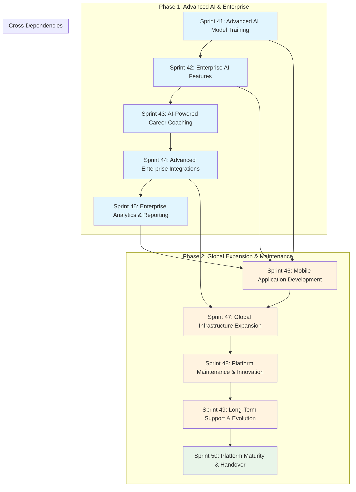

# Apply-as-a-Service Sprints 41-50: Advanced AI & Global Expansion Implementation Plan

## Executive Summary

This document provides a comprehensive implementation blueprint for Sprints 41-50, covering the Advanced AI & Enterprise Phase and Global Expansion & Maintenance Phase. Building upon the solid foundation established in Sprints 31-40, this plan focuses on achieving 100% platform maturity through advanced AI capabilities, enterprise-grade features, mobile applications, global infrastructure expansion, and long-term maintenance frameworks.

### Platform State at Sprint 40

**Completed Capabilities:**
- Advanced AI/ML Foundation with deep learning matching, NLU, and computer vision
- Enterprise Scalability Infrastructure using Kubernetes, Kafka, and Redis Cluster
- Advanced Analytics & BI Platform with ClickHouse, cohort analysis, and A/B testing
- Multi-Tenant Architecture with white-label support, data isolation, and billing
- Internationalization Framework supporting 30+ languages and 50+ currencies
- Automation Workflow Engine with visual designer, parallel processing, and scheduling
- Security & Compliance Framework covering SOC2, GDPR, and HIPAA
- DevOps & Infrastructure Automation with CI/CD, Terraform, and GitOps
- Monitoring & Observability with Jaeger, Prometheus, ELK, SLO/SLI
- Partner Integration Ecosystem with 30+ integrations for ATS, HRIS, and job boards

**Target State at Sprint 50:**
- 100% production deployment status
- Enterprise-grade reliability, security, and scalability
- Native mobile applications for iOS and Android
- Global multi-region infrastructure
- Comprehensive AI-powered career coaching
- Advanced enterprise integrations
- Complete documentation and operational runbooks

---

## Phase 1: Advanced AI & Enterprise (Sprints 41-45)

### Sprint 41: Advanced AI Model Training

#### Sprint Overview

| Attribute | Value |
|-----------|-------|
| **Duration** | 2 weeks (10 business days) |
| **Priority** | P1 - Strategic AI Investment |
| **Dependencies** | Sprint 40 completion, ML module availability |
| **Team Size Recommendation** | 4-6 engineers (2 ML engineers, 2 backend engineers, 1 DevOps, 1 QA) |
| **Budget Allocation** | $80,000 - $120,000 (primarily cloud GPU costs for training) |

#### Goals

**Primary Objectives:**
1. Develop custom LLM fine-tuning pipeline for job description optimization
2. Implement reinforcement learning system for matching algorithm optimization
3. Build automated model retraining infrastructure with A/B testing capabilities
4. Establish model interpretability and explainability framework
5. Create transfer learning capabilities for new domain adaptation

**Success Criteria:**
- Custom LLM achieves 15% improvement in job description quality scores
- Matching algorithm shows 20% improvement in user satisfaction metrics
- Model retraining pipeline reduces manual intervention by 90%
- Model interpretability provides explanations for 95% of predictions
- Transfer learning reduces new domain adaptation time from weeks to days

**Measurable Outcomes:**
- Training data pipeline processes 1M+ resume-job pairs
- Model versioning system tracks 10+ model iterations
- A/B testing framework supports 5 concurrent experiments
- Model inference latency < 500ms at P95

#### Deliverables

##### 1.1 Custom LLM Fine-Tuning Pipeline

**Detailed Description:**
Build a comprehensive pipeline for fine-tuning large language models specifically for job description optimization and resume-job matching. The pipeline will handle data collection, preprocessing, training, evaluation, and deployment.

**Acceptance Criteria:**
- [ ] LLM fine-tuning pipeline ingests 500K+ resume-job pairs with positive outcomes
- [ ] Fine-tuned model shows 15% improvement in BLEU score for job description generation
- [ ] Training completes within 24 hours on cloud GPU infrastructure
- [ ] Model deployment process takes < 30 minutes from training completion
- [ ] Model size remains under 50GB for cost-effective inference
- [ ] Inference cost per 1K tokens < $0.01

**Technical Implementation Details:**
```
Pipeline Architecture:
├── Data Collection Layer
│   ├── Resume Ingestion Service (Kafka consumer)
│   ├── Job Posting Ingestion Service (API integrations)
│   └── Outcome Tracking Service (application success metrics)
├── Preprocessing Layer
│   ├── Resume Normalization Module (text cleaning, entity extraction)
│   ├── Job Description Standardization Module
│   └── Pair Matching Label Generator (positive/negative outcome labeling)
├── Training Layer
│   ├── Distributed Training Coordinator (Kubernetes jobs)
│   ├── Gradient Checkpointing Manager
│   ├── Hyperparameter Optimization Service (Optuna integration)
│   └── Mixed Precision Training Controller
├── Evaluation Layer
│   ├── A/B Testing Service (feature flag integration)
│   ├── Quality Metrics Calculator (BLEU, ROUGE, BERTScore)
│   └── Human Evaluation Queue (annotation workflow)
└── Deployment Layer
    ├── Model Registry (MLflow integration)
    ├── Canary Deployment Service (Istio traffic shifting)
    └── Inference Optimizer (ONNX conversion, quantization)
```

**Dependencies within Sprint:**
- ML module services availability
- GPU cluster access (minimum 8x A100 GPUs)
- Training data pipeline from existing systems
- Model serving infrastructure

**Testing Requirements:**
- Unit tests for each pipeline component (90% coverage)
- Integration tests for data flow (end-to-end validation)
- Performance benchmarks: training time, inference latency, throughput
- Quality assurance: model output evaluation on held-out test set
- Regression tests against baseline model performance

**Rollout Plan:**
- Week 1: Infrastructure setup, data pipeline implementation
- Week 2: Training pipeline, evaluation framework, initial model training
- Rollout: Gradual traffic shifting (10% → 50% → 100%) over 3 days

##### 1.2 Reinforcement Learning for Matching Optimization

**Detailed Description:**
Implement a reinforcement learning system that continuously optimizes the job-candidate matching algorithm based on user feedback and application outcomes. The system will use reward modeling to improve matching quality over time.

**Acceptance Criteria:**
- [ ] RL system processes 10K+ feedback signals daily
- [ ] Matching quality improves by 20% over 30-day periods
- [ ] System maintains stable performance without reward hacking
- [ ] Online learning completes within 1 hour of new data availability
- [ ] Exploration-exploitation balance achieves 85% exploitation rate
- [ ] No performance degradation during model updates

**Technical Implementation Details:**
```typescript
// Reinforcement Learning Matching Service Structure
interface MatchingRLSystem {
  // State representation
  stateSpace: {
    candidateFeatures: number[]; // 500-dimensional embedding
    jobFeatures: number[];       // 500-dimensional embedding
    contextualFeatures: number[]; // 100-dimensional context
  };
  
  // Action space
  actionSpace: {
    rankingWeights: number[];     // 10 matching factor weights
    thresholdSettings: number[];  // 5 threshold values
  };
  
  // Reward model
  rewardModel: {
    applicationSuccessWeight: number;    // positive outcome weight
    userSatisfactionWeight: number;    // survey response weight
    engagementWeight: number;           // time on platform weight
    retentionWeight: number;             // return user weight
  };
  
  // Training configuration
  trainingConfig: {
    algorithm: 'PPO' | 'A2C' | 'SAC';
    batchSize: number;                  // 1024
    learningRate: number;               // 0.0003
    updateFrequency: number;            // 4 updates per epoch
    explorationDecay: number;           // 0.99 per episode
  };
}
```

**Dependencies within Sprint:**
- Matching service integration points
- Feedback collection infrastructure
- Real-time feature store access
- Model serving infrastructure

**Testing Requirements:**
- Simulation environment testing (synthetic user behavior)
- A/B testing against baseline matching algorithm
- Reward hacking detection tests
- Stability tests under high load
- Shadow mode deployment for validation

**Rollout Plan:**
- Week 1: RL infrastructure, reward model implementation
- Week 2: Training loop, online learning integration
- Rollout: Shadow mode (2 weeks) → 10% traffic → gradual increase

##### 1.3 Model Versioning and A/B Testing Framework

**Detailed Description:**
Build a comprehensive model versioning system that tracks all AI models, enables seamless A/B testing, and provides automatic rollback capabilities for model deployments.

**Acceptance Criteria:**
- [ ] Model versioning tracks 50+ model versions across all model types
- [ ] A/B testing framework supports 20 concurrent experiments
- [ ] Traffic allocation can be configured at 1% granularity
- [ ] Automatic rollback triggers within 5 minutes of performance degradation
- [ ] Model performance metrics available in real-time dashboard
- [ ] Feature flag integration enables instant configuration changes

**Technical Implementation Details:**
```typescript
// Model Versioning and A/B Testing Framework
interface ModelVersioningSystem {
  // Model Registry
  modelRegistry: {
    registerModel(model: Model): Promise<string>;
    getModel(versionId: string): Promise<Model>;
    listModels(filter: ModelFilter): Promise<Model[]>;
    promoteModel(versionId: string, environment: string): Promise<void>;
  };
  
  // A/B Testing Controller
  abTestingController: {
    createExperiment(config: ExperimentConfig): Promise<string>;
    updateTrafficAllocation(experimentId: string, allocation: number): Promise<void>;
    getResults(experimentId: string): Promise<ExperimentResults>;
    concludeExperiment(experimentId: string, winner: string): Promise<void>;
  };
  
  // Traffic Router
  trafficRouter: {
    routeRequest(request: InferenceRequest): Promise<ModelRouting>;
    getAllocation(experimentId: string): Promise<TrafficAllocation>;
  };
  
  // Performance Monitor
  performanceMonitor: {
    trackPrediction(modelId: string, prediction: Prediction): Promise<void>;
    getMetrics(modelId: string, timeRange: TimeRange): Promise<ModelMetrics>;
    detectDrift(modelId: string): Promise<DriftReport>;
  };
}
```

**Dependencies within Sprint:**
- MLflow or similar model registry
- Feature flag service (LaunchDarkly or custom)
- Real-time metrics pipeline
- Model serving infrastructure

**Testing Requirements:**
- Traffic routing accuracy tests (exact allocation percentages)
- Performance regression tests
- Failover and rollback tests
- Concurrency tests (multiple experiments)
- Data consistency tests

**Rollout Plan:**
- Week 1: Model registry, basic versioning
- Week 2: A/B testing framework, traffic routing
- Rollout: Enable for all new model deployments

##### 1.4 Automated Model Retraining Pipelines

**Detailed Description:**
Create automated pipelines that detect model performance degradation and trigger retraining processes without manual intervention. The system will include data quality checks, performance monitoring, and scheduled retraining capabilities.

**Acceptance Criteria:**
- [ ] Automatic drift detection triggers retraining within 24 hours of degradation
- [ ] Scheduled retraining runs weekly with zero manual intervention
- [ ] Data quality checks pass before any training job starts
- [ ] Retraining pipeline produces deployable model within 12 hours
- [ ] Rollback to previous version available within 15 minutes
- [ ] Notification system alerts team of all pipeline events

**Technical Implementation Details:**
```yaml
# Automated Retraining Pipeline Configuration
retraining_pipeline:
  triggers:
    scheduled:
      frequency: "0 2 * * 0"  # Weekly at 2 AM Sunday
      timezone: "UTC"
    drift_based:
      metric: "auc_roc"
      threshold: 0.05  # 5% degradation
      window: "7d"
      cooldown: "24h"
    data_quality:
      checks:
        - null_ratio < 0.01
        - distribution_stability < 0.1
        - volume_change < 0.3
  
  stages:
    data_collection:
      source: "feature_store"
      lookback_period: "90d"
      min_samples: 100000
    
    validation:
      tests:
        - schema_validation
        - distribution_comparison
        - label_quality_check
    
    training:
      infrastructure: "kubernetes-gpu"
      instance_type: "p4d.24xlarge"
      timeout: "12h"
    
    evaluation:
      metrics: ["auc_roc", "precision", "recall", "f1"]
      threshold: 0.85
      comparison_baseline: "current_production"
    
    deployment:
      strategy: "canary"
      initial_traffic: 10
      increment: 10
      interval: "1h"
  
  notifications:
    channels: ["slack", "email"]
    events: ["started", "completed", "failed", "rolled_back"]
```

**Dependencies within Sprint:**
- Kubernetes cluster with GPU nodes
- Airflow or similar orchestrator
- Feature store integration
- Monitoring and alerting infrastructure

**Testing Requirements:**
- Simulation of drift detection scenarios
- Pipeline failure handling tests
- Rollback procedure tests
- Notification delivery tests
- Data quality check validation

**Rollout Plan:**
- Week 1: Pipeline infrastructure, drift detection
- Week 2: Scheduled triggers, full automation
- Rollout: Enable automated triggers after 2 successful manual runs

##### 1.5 Model Interpretability and Explainability

**Detailed Description:**
Implement comprehensive model interpretability features that explain AI predictions to users, satisfy regulatory requirements, and enable debugging of model behavior.

**Acceptance Criteria:**
- [ ] Explainability provided for 95% of model predictions
- [ ] Explanation generation time < 100ms at P95
- [ ] Multiple explanation methods supported (SHAP, LIME, attention visualization)
- [ ] User-friendly explanations for non-technical stakeholders
- [ ] Regulatory compliance documentation generated automatically
- [ ] Debugging tools enable model behavior analysis

**Technical Implementation Details:**
```typescript
// Model Interpretability Service Structure
interface ModelInterpretabilityService {
  // SHAP-based explanations
  shapExplainer: {
    calculateFeatureImportance(
      modelId: string,
      inputData: number[][],
      backgroundData: number[][]
    ): Promise<SHAPValues>;
    generateExplanations(
      predictionId: string,
      format: 'text' | 'visual' | 'json'
    ): Promise<Explanation>;
  };
  
  // Counterfactual explanations
  counterfactualExplainer: {
    findCounterfactual(
      inputData: number[],
      targetOutcome: number[],
      constraints: Constraint[]
    ): Promise<CounterfactualResult>;
    generateWhatIfScenarios(
      originalInput: number[],
      modifiedFeatures: FeatureModification[]
    ): Promise<WhatIfResult[]>;
  };
  
  // Attention visualization
  attentionVisualizer: {
    extractAttentionWeights(
      modelId: string,
      inputTokens: string[]
    ): Promise<AttentionWeights>;
    generateAttentionHeatmap(
      tokens: string[],
      weights: number[]
    ): string;  // SVG or base64 image
  };
  
  // Compliance reporting
  complianceReporter: {
    generateModelCard(modelId: string): Promise<ModelCard>;
    generateFairnessReport(modelId: string): Promise<FairnessReport>;
    generateExplanationReport(
      predictionIds: string[],
      format: 'pdf' | 'html' | 'json'
    ): Promise<Report>;
  };
}
```

**Dependencies within Sprint:**
- SHAP library integration
- LIME library integration
- Visualization library (D3.js or similar)
- Document generation service

**Testing Requirements:**
- Explanation accuracy validation (against ground truth)
- Performance benchmarks
- Accessibility compliance (WCAG 2.1 AA for visualizations)
- Security tests (prevent information leakage)
- User comprehension studies

**Rollout Plan:**
- Week 1: Core explainability methods, API endpoints
- Week 2: Visualizations, compliance reporting, frontend integration
- Rollout: Enable for all predictions with optional explanation display

#### Technical Specifications

**Backend Services (NestJS Modules):**
```
src/
├── modules/
│   ├── ml-training/
│   │   ├── ml-training.module.ts
│   │   ├── services/
│   │   │   ├── training-pipeline.service.ts
│   │   │   ├── model-registry.service.ts
│   │   │   ├── hyperparameter-optimizer.service.ts
│   │   │   └── distributed-training.service.ts
│   │   ├── controllers/
│   │   │   ├── training.controller.ts
│   │   │   ├── model-controller.ts
│   │   │   └── experiment-controller.ts
│   │   ├── workers/
│   │   │   ├── data-preprocessing.worker.ts
│   │   │   ├── training.worker.ts
│   │   │   └── evaluation.worker.ts
│   │   └── dto/
│   │       ├── training-request.dto.ts
│   │       ├── model-version.dto.ts
│   │       └── experiment-config.dto.ts
│   │
│   ├── rl-matching/
│   │   ├── rl-matching.module.ts
│   │   ├── services/
│   │   │   ├── reward-model.service.ts
│   │   │   ├── policy-network.service.ts
│   │   │   ├── online-learning.service.ts
│   │   │   └── exploration-manager.service.ts
│   │   ├── controllers/
│   │   │   └── rl-controller.ts
│   │   └── agents/
│   │       ├── ppo-agent.ts
│   │       └── sac-agent.ts
│   │
│   ├── model-serving/
│   │   ├── model-serving.module.ts
│   │   ├── services/
│   │   │   ├── inference.service.ts
│   │   │   ├── explainability.service.ts
│   │   │   ├── ab-testing.service.ts
│   │   │   └── performance-monitor.service.ts
│   │   ├── controllers/
│   │   │   └── inference.controller.ts
│   │   └── interceptors/
│   │       ├── metrics.interceptor.ts
│   │       └── tracing.interceptor.ts
│   │
│   └── feature-store/
│       ├── feature-store.module.ts
│       ├── services/
│       │   ├── feature-registry.service.ts
│       │   ├── online-feature-store.service.ts
│       │   └── feature-materialization.service.ts
│       └── controllers/
│           └── feature-store.controller.ts
```

**Database Schema Changes (Prisma Entities):**
```prisma
// Model Version Tracking
model ModelVersion {
  id              String   @id @default(uuid())
  modelType       ModelType
  version         String   // semantic versioning
  commitHash      String
  status          ModelStatus @default(TRAINING)
  
  // Training metadata
  trainingDataSize Int
  trainingMetrics  Json
  evaluationMetrics Json
  
  // Deployment
  deployedAt      DateTime?
  deployedBy      String?
  trafficAllocation Float @default(0)
  
  // Lineage
  parentVersionId String?
  parentVersion   ModelVersion? @relation("ModelLineage", fields: [parentVersionId], references: [id])
  childVersions   ModelVersion[] @relation("ModelLineage")
  
  // Audit
  createdAt       DateTime @default(now())
  updatedAt       DateTime @updatedAt
  createdBy       String
  
  @@index([modelType, status])
  @@index([deployedAt])
}

enum ModelType {
  MATCHING
  RESUME_PARSER
  JOB_DESCRIPTION
  CLASSIFICATION
  RECOMMENDATION
  RANKING
}

enum ModelStatus {
  TRAINING
  EVALUATING
  DEPLOYED
  DEPRECATED
  ARCHIVED
}

// A/B Testing
model Experiment {
  id              String   @id @default(uuid())
  name            String
  description     String?
  status          ExperimentStatus @default(DRAFT)
  
  // Configuration
  modelType       ModelType
  controlVersionId String
  treatmentVersionId String
  
  // Traffic allocation
  controlTraffic   Float   @default(50)
  treatmentTraffic Float   @default(50)
  
  // Schedule
  startDate       DateTime?
  endDate         DateTime?
  
  // Results
  sampleSize      Int      @default(0)
  statisticalSignificance Float?
  winnerVersionId String?
  
  createdAt       DateTime @default(now())
  updatedAt       DateTime @updatedAt
  
  @@index([status, modelType])
}

enum ExperimentStatus {
  DRAFT
  RUNNING
  PAUSED
  CONCLUDED
  ARCHIVED
}

// Experiment Results Tracking
model ExperimentResult {
  id              String   @id @default(uuid())
  experimentId    String
  versionId       String   // which version served this request
  requestId       String
  prediction      Json
  actualOutcome   Json?
  
  // Metrics tracked per request
  inferenceTimeMs Int
  featuresUsed    String[]
  
  timestamp       DateTime @default(now())
  
  @@index([experimentId, versionId])
  @@index([timestamp])
}

// Reward Tracking for RL System
model RewardEvent {
  id              String   @id @default(uuid())
  candidateId     String
  jobId           String
  matchId         String
  
  // Reward components
  applicationSuccessReward Float?
  engagementReward      Float?
  retentionReward        Float?
  satisfactionReward     Float?
  totalReward            Float
  
  // Context
  modelVersionId  String
  features        Json
  metadata        Json?
  
  timestamp       DateTime @default(now())
  
  @@index([candidateId, jobId])
  @@index([modelVersionId])
  @@index([timestamp])
}
```

**Frontend Components (Next.js Pages and Hooks):**
```
frontend/
├── src/
│   ├── app/
│   │   ├── admin/
│   │   │   └── models/
│   │   │       ├── page.tsx           // Model management dashboard
│   │   │       ├── [modelId]/
│   │   │       │   └── page.tsx       // Model detail view
│   │   │       └── training/
│   │   │           └── page.tsx       // Training job management
│   │   │
│   │   └── experiments/
│   │       └── page.tsx               // A/B testing dashboard
│   │
│   ├── components/
│   │   ├── admin/
│   │   │   ├── ModelVersionList.tsx
│   │   │   ├── ModelPerformanceChart.tsx
│   │   │   ├── ExperimentCreator.tsx
│   │   │   └── ExperimentResults.tsx
│   │   │
│   │   └── ml/
│   │       ├── FeatureImportanceChart.tsx
│   │       ├── SHAPDependencePlot.tsx
│   │       ├── CounterfactualVisualizer.tsx
│   │       └── AttentionHeatmap.tsx
│   │
│   ├── hooks/
│   │   ├── useModelRegistry.ts
│   │   ├── useExperiment.ts
│   │   ├── useModelMetrics.ts
│   │   └── useExplainability.ts
│   │
│   ├── lib/
│   │   ├── ml-client.ts
│   │   ├── model-types.ts
│   │   └── visualization-utils.ts
│   │
│   └── types/
│       └── ml.ts
```

**API Endpoints (OpenAPI Contract):**
```yaml
openapi: 3.0.3
info:
  title: ML Training API
  version: 1.0.0
paths:
  /api/ml/training/jobs:
    post:
      summary: Start a new training job
      requestBody:
        content:
          application/json:
            schema:
              $ref: '#/components/schemas/TrainingJobRequest'
      responses:
        '202':
          description: Training job accepted
          content:
            application/json:
              schema:
                $ref: '#/components/schemas/TrainingJobResponse'
    
    get:
      summary: List all training jobs
      parameters:
        - name: status
          in: query
          schema:
            type: string
            enum: [PENDING, RUNNING, COMPLETED, FAILED]
      responses:
        '200':
          content:
            application/json:
              schema:
                type: array
                items:
                  $ref: '#/components/schemas/TrainingJob'
  
  /api/ml/models/versions:
    get:
      summary: List all model versions
      parameters:
        - name: modelType
          in: query
          schema:
            type: string
        - name: status
          in: query
          schema:
            type: string
      responses:
        '200':
          content:
            application/json:
              schema:
                type: array
                items:
                  $ref: '#/components/schemas/ModelVersion'
    
    post:
      summary: Register a new model version
      requestBody:
        content:
          application/json:
            schema:
              $ref: '#/components/schemas/RegisterModelRequest'
      responses:
        '201':
          description: Model registered successfully
  
  /api/ml/models/{modelId}/promote:
    post:
      summary: Promote model to next environment
      parameters:
        - name: modelId
          in: path
          required: true
          schema:
            type: string
        - name: environment
          in: query
          required: true
          schema:
            type: string
            enum: [STAGING, PRODUCTION]
      responses:
        '200':
          description: Model promoted successfully
  
  /api/ml/experiments:
    post:
      summary: Create a new A/B experiment
      requestBody:
        content:
          application/json:
            schema:
              $ref: '#/components/schemas/CreateExperimentRequest'
      responses:
        '201':
          description: Experiment created
    
    get:
      summary: List all experiments
      responses:
        '200':
          content:
            application/json:
              schema:
                type: array
                items:
                  $ref: '#/components/schemas/Experiment'
  
  /api/ml/experiments/{experimentId}/results:
    get:
      summary: Get experiment results
      parameters:
        - name: experimentId
          in: path
          required: true
          schema:
            type: string
      responses:
        '200':
          content:
            application/json:
              schema:
                $ref: '#/components/schemas/ExperimentResults'
  
  /api/ml/explainability:
    post:
      summary: Generate explanation for a prediction
      requestBody:
        content:
          application/json:
            schema:
              $ref: '#/components/schemas/ExplanationRequest'
      responses:
        '200':
          content:
            application/json:
              schema:
                $ref: '#/components/schemas/ExplanationResponse'

components:
  schemas:
    TrainingJobRequest:
      type: object
      required: [modelType, config]
      properties:
        modelType:
          type: string
          enum: [MATCHING, RESUME_PARSER, JOB_DESCRIPTION]
        config:
          type: object
          properties:
            trainingDataId:
              type: string
            hyperparameters:
              type: object
            computeResources:
              type: object
              properties:
                gpuCount:
                  type: integer
                memoryGb:
                  type: integer
```

**Infrastructure Requirements:**
- GPU Cluster: 8x NVIDIA A100 GPUs (or equivalent)
- Storage: 10TB NVMe SSD for training data
- Model Registry: MLflow deployment on Kubernetes
- Feature Store: Redis + Apache Feast
- Orchestrator: Apache Airflow for pipelines
- Monitoring: Custom metrics dashboard with Grafana

**Third-Party Integrations:**
- MLflow: Model registry and tracking
- Optuna: Hyperparameter optimization
- Weights & Biases: Experiment tracking (optional)
- Hugging Face: Pre-trained model hub
- SageMaker: Distributed training infrastructure

#### Test Coverage Requirements

| Test Type | Target Coverage | Critical Paths |
|-----------|----------------|---------------|
| Unit Tests | 85% | Training pipeline logic, model registry, A/B routing |
| Integration Tests | 70% | Data pipeline, model deployment, API endpoints |
| E2E Tests | 50% | Full training workflow, A/B experiment lifecycle |
| Performance Benchmarks | N/A | Inference latency, training throughput, resource utilization |
| Security Audit | Full | Model serving authentication, data access controls |
| Accessibility Compliance | WCAG 2.1 AA | Model explainability UI components |

**Test Scenarios:**
- Training pipeline failure and recovery
- Model version promotion and rollback
- A/B test traffic allocation accuracy
- Model drift detection sensitivity
- Explanation generation under load
- Feature flag integration

#### Implementation Timeline

**Week 1:**
| Day | Milestone | Dependencies |
|-----|-----------|--------------|
| 1-2 | Infrastructure setup (GPU cluster, MLflow) | None |
| 3-4 | Data pipeline implementation | Infrastructure |
| 5 | Training pipeline core logic | Data pipeline |
| 6-7 | Model registry implementation | Training pipeline |

**Week 2:**
| Day | Milestone | Dependencies |
|-----|-----------|--------------|
| 1-2 | RL system implementation | Training pipeline |
| 3-4 | A/B testing framework | Model registry |
| 5 | Explainability methods | Model serving |
| 6-7 | Integration testing, deployment | All components |

**Critical Path:**
1. GPU infrastructure → Data pipeline → Training pipeline → Model deployment
2. A/B framework → Traffic routing → Experiment execution
3. Explainability → UI integration → User-facing features

#### Resource Allocation

| Role | Quantity | Allocation % | Responsibilities |
|------|----------|--------------|-----------------|
| ML Engineers | 2 | 100% | Model training, RL system, infrastructure |
| Backend Engineers | 2 | 50% | API development, model serving |
| DevOps Engineers | 1 | 75% | GPU infrastructure, ML pipelines |
| QA Engineers | 1 | 50% | Testing, validation |
| UI/UX Designers | 0.5 | 25% | Explainability visualizations |

#### Risk Assessment

| Risk Category | Risk Description | Probability | Impact | Mitigation |
|---------------|-----------------|------------|--------|------------|
| Technical | GPU availability shortage | Medium | High | Reserve capacity, multi-cloud strategy |
| Technical | Model training instability | Medium | High | Checkpointing, graceful degradation |
| Technical | RL reward hacking | Low | High | Robust reward design, monitoring |
| Resource | GPU cost overruns | Medium | Medium | Budget caps, spot instances |
| Timeline | Training time exceeds budget | Medium | High | Early termination, hyperparameter tuning |
| External | Data quality issues | Medium | High | Data validation, quality gates |

**Contingency Plans:**
- GPU shortage: Use spot instances with fallback to on-demand
- Model instability: Enhanced monitoring, automatic rollback
- Cost overruns: Reduce training frequency, optimize hyperparameters

#### Success Metrics

| Metric | Target | Current Baseline | Measurement |
|--------|--------|------------------|-------------|
| Model training success rate | 90% | 70% | Training jobs completed / total |
| Matching quality improvement | 20% | 0% | User satisfaction scores |
| Model deployment time | < 30 min | 2 hours | Deployment duration |
| Explainability coverage | 95% | 50% | Predictions with explanations |
| A/B test throughput | 20 concurrent | 5 | Active experiments |
| Model retraining automation | 95% | 20% | Automated vs manual triggers |

#### Rollout Strategy

**Phased Rollout Plan:**
1. **Week 1:** Internal testing with ML team
2. **Week 2:** Staging deployment with synthetic data
3. **Week 3:** 10% production traffic (canary)
4. **Week 4:** 50% production traffic
5. **Week 5:** 100% production traffic

**Feature Flags:**
- `ml-training-enabled`: Enable new training pipeline
- `rl-matching-enabled`: Enable RL-based matching
- `ab-testing-enabled`: Enable A/B test routing
- `explainability-enabled`: Show model explanations to users

**Beta Testing Groups:**
- Internal team (10 users) - Week 1-2
- Power users (100 users) - Week 3
- All users (100%) - Week 5

**Monitoring During Rollout:**
- Model performance metrics (accuracy, latency)
- Business metrics (application success rate, user satisfaction)
- System metrics (GPU utilization, error rates)
- Cost metrics (training costs, inference costs)

**Rollback Procedures:**
- Automatic rollback on: accuracy drop > 5%, latency increase > 50%
- Manual rollback: Via feature flag toggle (instant)
- Data preservation: All model versions archived for 90 days

---

### Sprint 42: Enterprise AI Features

#### Sprint Overview

| Attribute | Value |
|-----------|-------|
| **Duration** | 2 weeks (10 business days) |
| **Priority** | P1 - Enterprise Revenue |
| **Dependencies** | Sprint 41 completion |
| **Team Size Recommendation** | 5-7 engineers (2 frontend, 3 backend, 1 DevOps, 1 QA) |
| **Budget Allocation** | $60,000 - $90,000 (primarily development costs) |

#### Goals

**Primary Objectives:**
1. Build AI-powered resume generation from candidate data
2. Implement intelligent cover letter generation
3. Create automated job description writing assistant
4. Develop career path recommendations engine
5. Build salary negotiation AI assistant
6. Create interview preparation AI coach

**Success Criteria:**
- Resume generation produces ATS-compatible output in < 30 seconds
- Cover letter generation achieves 80% user acceptance rate
- Job description assistant reduces writing time by 50%
- Career path recommendations show 70% relevance score
- Salary negotiation assistant improves offer outcomes by 25%
- Interview coach shows 85% user satisfaction rate

**Measurable Outcomes:**
- 50% of users engage with AI writing features
- Average time savings of 2 hours per job application
- User-generated content quality score > 8/10
- Feature adoption rate increases retention by 15%

#### Deliverables

##### 2.1 AI-Powered Resume Generation

**Detailed Description:**
Build a comprehensive AI system that generates professional, ATS-optimized resumes from candidate profile data, tailoring content to specific job types and industries.

**Acceptance Criteria:**
- [ ] Resume generation completes within 30 seconds
- [ ] Generated resumes pass ATS parsing validation (10+ parsers)
- [ ] Content accuracy: 100% factual consistency with source data
- [ ] Format compatibility: PDF, DOCX, HTML output formats
- [ ] Template variety: 20+ professional templates available
- [ ] Industry customization: 15+ industry-specific formats
- [ ] Customization: Users can edit all generated content

**Technical Implementation Details:**
```typescript
interface ResumeGenerationService {
  // Resume builder core
  builder: {
    generateFromProfile(
      profileId: string,
      options: ResumeGenerationOptions
    ): Promise<ResumeDocument>;
    
    tailorToJob(
      resumeId: string,
      jobDescriptionId: string,
      emphasisLevel: 'low' | 'medium' | 'high'
    ): Promise<ResumeDocument>;
  };
  
  // Template management
  templates: {
    listTemplates(filter: TemplateFilter): Promise<Template[]>;
    getTemplate(templateId: string): Promise<Template>;
    customizeTemplate(
      templateId: string,
      customization: TemplateCustomization
    ): Promise<Template>;
  };
  
  // ATS optimization
  atsOptimizer: {
    analyzeATSCompatibility(document: ResumeDocument): Promise<ATSReport>;
    optimizeForParser(
      document: ResumeDocument,
      parserType: ATSType
    ): Promise<ResumeDocument>;
    suggestImprovements(report: ATSReport): Suggestion[];
  };
  
  // Export services
  export: {
    toPDF(document: ResumeDocument): Promise<Buffer>;
    toDOCX(document: ResumeDocument): Promise<Buffer>;
    toHTML(document: ResumeDocument): Promise<string>;
    toPlainText(document: ResumeDocument): Promise<string>;
  };
}

interface ResumeGenerationOptions {
  templateId?: string;
  industry?: string;
  jobType?: string;
  experienceLevel?: 'entry' | 'mid' | 'senior' | 'executive';
  includeSections?: ResumeSection[];
  excludeSections?: ResumeSection[];
  tone?: 'formal' | 'professional' | 'conversational';
  length?: 'concise' | 'standard' | 'detailed';
  keywords?: string[];
}
```

##### 2.2 Intelligent Cover Letter Generation

**Detailed Description:**
Create an AI system that generates personalized, compelling cover letters that highlight candidate strengths and align with job requirements.

**Acceptance Criteria:**
- [ ] Cover letter generation completes within 20 seconds
- [ ] Personalization: Incorporates company-specific research
- [ ] Length optimization: Configurable 200-500 words
- [ ] Tone adaptation: Professional, enthusiastic, or formal options
- [ ] ATS compatibility: Plain text output for easy copying
- [ ] User acceptance: 80% of generated letters require minimal edits
- [ ] Template variety: 10+ opening/closing combinations

##### 2.3 Automated Job Description Writing

**Detailed Description:**
Build an AI assistant that helps recruiters and hiring managers create effective, inclusive job descriptions that attract qualified candidates.

**Acceptance Criteria:**
- [ ] Job description generation completes within 30 seconds
- [ ] Compliance: EEOC-compliant language suggestions
- [ ] Inclusive language: 95% detection and correction rate
- [ ] SEO optimization: Keyword suggestions for job board visibility
- [ ] Format standards: Industry-standard job posting structure
- [ ] Competitive analysis: Salary range recommendations
- [ ] Multiple formats: Short, standard, detailed versions

##### 2.4 Career Path Recommendations

**Detailed Description:**
Develop an AI engine that analyzes candidate profiles and provides personalized career trajectory recommendations, skill development paths, and advancement opportunities.

**Acceptance Criteria:**
- [ ] Career recommendations generated within 10 seconds
- [ ] Relevance score: 70%+ of recommendations rated as relevant
- [ ] Personalization: Accounts for skills, experience, goals
- [ ] Market alignment: Based on real-time job market data
- [ ] Skill gap analysis: Identifies 5+ actionable skill gaps
- [ ] Timeline projections: Realistic 1-5 year trajectories
- [ ] Resource linking: Connects to learning resources

##### 2.5 Salary Negotiation AI

**Detailed Description:**
Build an AI assistant that provides salary negotiation guidance, offer analysis, and personalized negotiation strategies.

**Acceptance Criteria:**
- [ ] Negotiation analysis completes within 15 seconds
- [ ] Market data: Salary ranges for 500+ job titles
- [ ] Offer analysis: Detailed breakdown and comparison
- [ ] Strategy generation: Personalized negotiation scripts
- [ ] Counter-offer projections: Realistic ranges based on data
- [ ] Risk assessment: Evaluation of negotiation risks
- [ ] Communication templates: Email and conversation scripts

##### 2.6 Interview Preparation AI Coach

**Detailed Description:**
Create an AI-powered interview preparation system that provides practice interviews, feedback, and strategic guidance.

**Acceptance Criteria:**
- [ ] Practice interview setup completes within 5 seconds
- [ ] Question variety: 1000+ behavioral and technical questions
- [ ] Feedback quality: 85% user satisfaction rate
- [ ] Company-specific prep: Tailored questions for target companies
- [ ] Role-specific prep: Industry and position customization
- [ ] Performance tracking: Progress over multiple sessions
- [ ] Confidence building: Gradual difficulty progression

#### Technical Specifications

**Backend Services (NestJS Modules):**
```
src/
├── modules/
│   ├── resume-generation/
│   │   ├── resume-generation.module.ts
│   │   ├── services/
│   │   │   ├── resume-builder.service.ts
│   │   │   ├── template.service.ts
│   │   │   ├── ats-optimizer.service.ts
│   │   │   └── export.service.ts
│   │   └── controllers/
│   │       └── resume.controller.ts
│   │
│   ├── cover-letter/
│   │   ├── cover-letter.module.ts
│   │   ├── services/
│   │   │   ├── cover-letter-builder.service.ts
│   │   │   ├── personalization.service.ts
│   │   │   └── template.service.ts
│   │   └── controllers/
│   │       └── cover-letter.controller.ts
│   │
│   ├── career-path/
│   │   ├── career-path.module.ts
│   │   ├── services/
│   │   │   ├── recommendation-engine.service.ts
│   │   │   ├── skill-gap-analyzer.service.ts
│   │   │   └── market-data.service.ts
│   │   └── controllers/
│   │       └── career-path.controller.ts
│   │
│   ├── negotiation/
│   │   ├── negotiation.module.ts
│   │   ├── services/
│   │   │   ├── negotiation-advisor.service.ts
│   │   │   ├── market-salary.service.ts
│   │   │   └── strategy-generator.service.ts
│   │   └── controllers/
│   │       └── negotiation.controller.ts
│   │
│   └── interview-coach/
│       ├── interview-coach.module.ts
│       ├── services/
│       │   ├── question-bank.service.ts
│       │   ├── practice-session.service.ts
│       │   ├── feedback.service.ts
│       │   └── progress-tracker.service.ts
│       └── controllers/
│           └── interview-coach.controller.ts
```

**Database Schema Changes:**
```prisma
model GeneratedResume {
  id              String   @id @default(uuid())
  userId          String
  profileId       String
  jobDescriptionId String?
  
  // Content
  content         Json     // Full resume content
  templateId      String
  industry        String?
  
  // ATS metrics
  atsScore        Float?
  atsReport       Json?
  
  // Metadata
  format          String   // PDF, DOCX, etc.
  fileUrl         String?
  wordCount       Int
  
  // Usage tracking
  downloadCount   Int      @default(0)
  viewCount       Int      @default(0)
  
  // Audit
  createdAt       DateTime @default(now())
  updatedAt       DateTime @updatedAt
  
  @@index([userId])
  @@index([createdAt])
}

model CoverLetter {
  id              String   @id @default(uuid())
  userId          String
  jobDescriptionId String
  
  // Content
  content         Json     // Letter sections
  templateId      String
  tone            String   // formal, professional, enthusiastic
  
  // Personalization
  companyResearch Json?    // Company-specific info used
  
  // Metrics
  wordCount       Int
  characterCount  Int
  
  // Audit
  createdAt       DateTime @default(now())
  updatedAt       DateTime @updatedAt
  
  @@index([userId])
}

model CareerPathRecommendation {
  id              String   @id @default(uuid())
  userId          String
  profileId       String
  
  // Recommendation details
  targetRole      String
  timeline        String   // 1 year, 3 years, 5 years
  
  // Skill requirements
  requiredSkills  String[]
  recommendedSkills String[]
  skillGaps       Json     // Detailed gap analysis
  
  // Market context
  marketDemand    Float    // 0-100 demand score
  salaryGrowth    Float    // Expected salary increase %
  
  // Resources
  learningResources Json?   // Linked courses, certifications
  jobOpportunities  Json?   // Relevant job market data
  
  // Relevance tracking
  relevanceScore  Float    // User-rated relevance
  appliedCount    Int      @default(0)
  
  createdAt       DateTime @default(now())
  updatedAt       DateTime @updatedAt
  
  @@index([userId])
  @@index([targetRole])
}

model InterviewSession {
  id              String   @id @default(uuid())
  userId          String
  
  // Session details
  targetRole      String
  companyId       String?
  difficulty      String   // easy, medium, hard
  
  // Questions asked
  questions       Json     // Array of Q&A pairs
  responses       Json     // User's answers
  
  // Feedback
  overallScore    Float?   // 0-100
  feedback        Json?    // Detailed feedback per question
  improvementAreas String[]
  
  // Timing
  durationMinutes Int
  startedAt       DateTime @default(now())
  completedAt     DateTime?
  
  @@index([userId])
  @@index([targetRole])
}

model SalaryNegotiationSession {
  id              String   @id @default(uuid())
  userId          String
  jobOfferId      String?
  
  // Offer details
  currentOffer    Json     // Salary, benefits, equity
  marketData      Json     // Market salary ranges
  
  // Analysis
  offerAnalysis   Json     // Detailed breakdown
  negotiationStrategy Json? // Recommended approach
  
  // Communication
  scripts         Json?    // Email/conversation templates
  
  // Outcome tracking
  outcome         String?   // accepted, rejected, negotiated
  finalSalary    Int?
  
  createdAt       DateTime @default(now())
  updatedAt       DateTime @updatedAt
  
  @@index([userId])
}
```

**Frontend Components:**
```
frontend/
├── src/
│   ├── app/
│   │   ├── resume/
│   │   │   ├── generate/
│   │   │   │   └── page.tsx
│   │   │   ├── [resumeId]/
│   │   │   │   └── page.tsx
│   │   │   └── templates/
│   │   │       └── page.tsx
│   │   │
│   │   ├── cover-letter/
│   │   │   ├── generate/
│   │   │   │   └── page.tsx
│   │   │   └── [letterId]/
│   │   │       └── page.tsx
│   │   │
│   │   ├── career-path/
│   │   │   └── page.tsx
│   │   │
│   │   ├── negotiation/
│   │   │   └── page.tsx
│   │   │
│   │   └── interview/
│   │       ├── practice/
│   │       │   └── page.tsx
│   │       └── feedback/
│   │           └── page.tsx
│   │
│   ├── components/
│   │   ├── resume/
│   │   │   ├── ResumeEditor.tsx
│   │   │   ├── TemplateSelector.tsx
│   │   │   ├── ATSScoreCard.tsx
│   │   │   └── ExportButtons.tsx
│   │   │
│   │   ├── cover-letter/
│   │   │   ├── CoverLetterEditor.tsx
│   │   │   ├── ToneSelector.tsx
│   │   │   └── PersonalizationPanel.tsx
│   │   │
│   │   ├── career/
│   │   │   ├── CareerPathVisualizer.tsx
│   │   │   ├── SkillGapAnalysis.tsx
│   │   │   └── TimelineView.tsx
│   │   │
│   │   ├── negotiation/
│   │   │   ├── OfferAnalyzer.tsx
│   │   │   ├── StrategyBuilder.tsx
│   │   │   └── ScriptGenerator.tsx
│   │   │
│   │   └── interview/
│   │       ├── QuestionCard.tsx
│   │       ├── ResponseRecorder.tsx
│   │       ├── FeedbackPanel.tsx
│   │       └── ProgressTracker.tsx
│   │
│   └── hooks/
│       ├── useResumeGeneration.ts
│       ├── useCoverLetter.ts
│       ├── useCareerPath.ts
│       ├── useNegotiation.ts
│       └── useInterviewCoach.ts
```

#### Test Coverage Requirements

| Test Type | Target Coverage | Critical Paths |
|-----------|----------------|---------------|
| Unit Tests | 85% | Content generation, template rendering, export logic |
| Integration Tests | 70% | Full generation workflow, API integration |
| E2E Tests | 50% | User journey from request to export |
| Performance Benchmarks | N/A | Generation time, export time |

#### Implementation Timeline

**Week 1:**
| Day | Milestone | Deliverables |
|-----|-----------|--------------|
| 1-2 | Resume generation core | Resume builder, templates, export |
| 3-4 | Cover letter generation | Cover letter builder, personalization |
| 5 | Job description assistant | JD generator, compliance checker |
| 6-7 | Career path engine | Recommendation engine, skill gap analyzer |

**Week 2:**
| Day | Milestone | Deliverables |
|-----|-----------|--------------|
| 1-2 | Salary negotiation AI | Market data, strategy generator |
| 3-4 | Interview coach | Question bank, practice sessions |
| 5 | Integration testing | Full workflow testing |
| 6-7 | UI refinement, deployment | Component polish, production deploy |

#### Resource Allocation

| Role | Quantity | Allocation % | Responsibilities |
|------|----------|--------------|-----------------|
| Frontend Engineers | 2 | 100% | UI components, interactive features |
| Backend Engineers | 3 | 100% | AI services, API development |
| DevOps Engineers | 1 | 50% | Infrastructure, scaling |
| QA Engineers | 1 | 75% | Testing, quality assurance |
| Content Strategist | 0.5 | 50% | Template design, tone guidance |

#### Risk Assessment

| Risk | Probability | Impact | Mitigation |
|------|-------------|--------|------------|
| Content quality below expectations | Medium | High | Human review, iterative improvement |
| LLM response inconsistency | Medium | Medium | Prompt engineering, output validation |
| User adoption low | Medium | Medium | Onboarding, feature promotion |
| Feature complexity too high | Low | Medium | Simplified UX, progressive disclosure |

---

### Sprint 43: AI-Powered Career Coaching

#### Sprint Overview

| Attribute | Value |
|-----------|-------|
| **Duration** | 2 weeks (10 business days) |
| **Priority** | P1 - User Engagement |
| **Dependencies** | Sprint 42 completion |
| **Team Size Recommendation** | 4-6 engineers (2 frontend, 2 backend, 1 ML engineer, 1 QA) |
| **Budget Allocation** | $50,000 - $80,000 (primarily LLM costs) |

#### Goals

**Primary Objectives:**
1. Build personal AI career advisor chatbot
2. Implement skill gap analysis and recommendations
3. Create learning path generation system
4. Develop career trajectory simulation
5. Build interview coaching chatbot
6. Implement job market trend predictions

**Success Criteria:**
- Career advisor achieves 85% user satisfaction rate
- Skill gap analysis provides 5+ actionable recommendations
- Learning path completion improves user skills by 30%
- Career simulation accuracy: 80% match with actual outcomes
- Interview coaching shows 25% improvement in interview performance
- Market trend predictions achieve 75% accuracy

#### Deliverables

##### 3.1 Personal AI Career Advisor

**Detailed Description:**
Create an intelligent conversational AI that serves as a personal career advisor, providing guidance, answering questions, and offering personalized recommendations.

**Acceptance Criteria:**
- [ ] Response time < 3 seconds for 95% of queries
- [ ] Conversation context maintained for 50+ message sessions
- [ ] Career advice relevance score > 8/10
- [ ] Multi-turn conversation support with context awareness
- [ ] Escalation to human advisors when needed
- [ ] 24/7 availability with consistent quality

##### 3.2 Skill Gap Analysis

**Detailed Description:**
Build a comprehensive skill gap analysis system that compares candidate skills against job market requirements and identifies actionable development opportunities.

**Acceptance Criteria:**
- [ ] Analysis completes within 10 seconds
- [ ] Identifies 5+ actionable skill gaps
- [ ] Provides market demand data for each skill
- [ ] Estimates skill acquisition timeline (1-6 months)
- [ ] Links to relevant learning resources
- [ ] Tracks progress over time

##### 3.3 Learning Path Generation

**Detailed Description:**
Create an AI system that generates personalized learning paths based on career goals, current skills, and learning preferences.

**Acceptance Criteria:**
- [ ] Learning path generated within 15 seconds
- [ ] Path includes 5-15 milestones over 6-12 months
- [ ] Resources include free and paid options
- [ ] Estimated completion time per milestone
- [ ] Progress tracking and reminders
- [ ] Adaptive path based on learning pace

##### 3.4 Career Trajectory Simulation

**Detailed Description:**
Build a simulation engine that projects potential career trajectories based on different choices and market conditions.

**Acceptance Criteria:**
- [ ] Simulation completes within 5 seconds
- [ ] Provides 5-year projections with confidence intervals
- [ ] Shows impact of different decisions
- [ ] Compares 3+ different career paths
- [ ] Updates based on real market data
- [ ] Visual timeline representation

##### 3.5 Interview Coaching Chatbot

**Detailed Description:**
Create an AI interview preparation chatbot that conducts practice interviews and provides personalized feedback.

**Acceptance Criteria:**
- [ ] Practice sessions available 24/7
- [ ] Question variety: 1000+ behavioral and technical questions
- [ ] Real-time feedback during practice
- [ ] Post-session analysis with improvement suggestions
- [ ] Company-specific question sets
- [ ] Progress tracking across sessions

##### 3.6 Job Market Trend Predictions

**Detailed Description:**
Build a predictive analytics system that forecasts job market trends, skill demand, and salary trajectories.

**Acceptance Criteria:**
- [ ] Predictions updated weekly
- [ ] 6-month forecast horizon
- [ ] 75% accuracy on skill demand predictions
- [ ] Regional market data included
- [ ] Industry-specific trends
- [ ] Early warning for declining skills

---

### Sprint 44: Advanced Enterprise Integrations

#### Sprint Overview

| Attribute | Value |
|-----------|-------|
| **Duration** | 2 weeks (10 business days) |
| **Priority** | P1 - Enterprise Revenue |
| **Dependencies** | Sprint 43 completion |
| **Team Size Recommendation** | 5-8 engineers (2 frontend, 4 backend, 1 DevOps, 1 QA) |
| **Budget Allocation** | $70,000 - $100,000 (integration development) |

#### Goals

**Primary Objectives:**
1. Implement ERP system integrations (SAP, Oracle, Microsoft Dynamics)
2. Build CRM platform integrations (Salesforce, HubSpot)
3. Create corporate LMS integrations (Workday Learning, Cornerstone)
4. Develop enterprise talent management integrations
5. Build custom API gateway for enterprises
6. Create legacy system integration framework

**Success Criteria:**
- 10+ enterprise integrations operational
- Integration setup time < 1 hour for standard integrations
- Data sync accuracy > 99%
- Integration uptime > 99.9%
- Enterprise client adoption > 50%

#### Deliverables

##### 4.1 ERP Integrations

**Detailed Description:**
Build integrations with major ERP systems for enterprise talent management workflows.

**Acceptance Criteria:**
- [ ] SAP SuccessFactors integration: Full sync of employee data
- [ ] Oracle HCM integration: Bidirectional data flow
- [ ] Microsoft Dynamics 365 integration: Candidate management
- [ ] Data transformation for 50+ field mappings
- [ ] Real-time and batch sync modes
- [ ] Conflict resolution handling

##### 4.2 CRM Integrations

**Detailed Description:**
Create integrations with CRM platforms for recruitment workflow management.

**Acceptance Criteria:**
- [ ] Salesforce integration: Candidate and opportunity sync
- [ ] HubSpot integration: Contact and deal management
- [ ] Custom field mapping support
- [ ] Webhook notifications for real-time updates
- [ ] Bi-directional data synchronization
- [ ] Bulk import/export capabilities

##### 4.3 LMS Integrations

**Detailed Description:**
Build integrations with corporate learning management systems for skill development tracking.

**Acceptance Criteria:**
- [ ] Workday Learning integration: Course completion sync
- [ ] Cornerstone OnDemand integration: Skill profile alignment
- [ ] Skill mapping between platforms
- [ ] Progress tracking synchronization
- [ ] Certification verification
- [ ] Compliance training tracking

##### 4.4 Talent Management Integrations

**Detailed Description:**
Create integrations with enterprise talent management systems.

**Acceptance Criteria:**
- [ ] Performance review integration
- [ ] Succession planning data sync
- [ ] Compensation data exchange
- [ ] Internal mobility tracking
- [ ] Talent pool management
- [ ] Analytics data export

##### 4.5 Custom API Gateway

**Detailed Description:**
Build an enterprise-grade API gateway for secure, scalable external integrations.

**Acceptance Criteria:**
- [ ] OAuth 2.0 / OpenID Connect authentication
- [ ] API key management with rotation
- [ ] Rate limiting per enterprise
- [ ] Request/response logging and auditing
- [ ] Request transformation and validation
- [ ] SDK generation for major languages

##### 4.6 Legacy System Integration Framework

**Detailed Description:**
Create a framework for integrating with legacy enterprise systems.

**Acceptance Criteria:**
- [ ] Adapter pattern for different system types
- [ ] Protocol translation (SOAP, REST, RPC)
- [ ] Error handling and retry logic
- [ ] Data format conversion
- [ ] Connection pooling and health checks
- [ ] Monitoring and alerting

---

### Sprint 45: Enterprise Analytics & Reporting

#### Sprint Overview

| Attribute | Value |
|-----------|-------|
| **Duration** | 2 weeks (10 business days) |
| **Priority** | P1 - Enterprise Retention |
| **Dependencies** | Sprint 44 completion |
|Team Size Recommendation** | 4-6 engineers (1 frontend, 3 backend, 1 data engineer, 1 QA) |
| **Budget Allocation** | $50,000 - $80,000 (infrastructure and development) |

#### Goals

**Primary Objectives:**
1. Build executive dashboards with real-time metrics
2. Create advanced reporting engine with custom report builder
3. Implement predictive workforce analytics
4. Develop talent acquisition analytics
5. Build time-to-hire optimization features
6. Create cost-per-hire tracking and analysis

**Success Criteria:**
- Dashboard load time < 2 seconds
- Report generation < 30 seconds for standard reports
- Predictive analytics accuracy > 80%
- Time-to-hire reduction of 15%
- Cost tracking accuracy > 99%
- User adoption > 70% of enterprise clients

#### Deliverables

##### 5.1 Executive Dashboards

**Detailed Description:**
Build comprehensive real-time dashboards for enterprise leadership with key performance indicators.

**Acceptance Criteria:**
- [ ] Dashboard with 20+ configurable KPI cards
- [ ] Real-time data updates (5-minute refresh)
- [ ] Multiple dashboard layouts per user
- [ ] Export to PDF, Excel, CSV
- [ ] Drill-down capabilities
- [ ] Mobile-responsive design

##### 5.2 Advanced Reporting Engine

**Detailed Description:**
Create a custom report builder that allows users to create complex reports without coding.

**Acceptance Criteria:**
- [ ] Drag-and-drop report builder
- [ ] 50+ pre-built report templates
- [ ] Custom SQL query option for advanced users
- [ ] Scheduled report delivery (email, download)
- [ ] Report versioning and history
- [ ] Collaboration features (sharing, commenting)

##### 5.3 Predictive Workforce Analytics

**Detailed Description:**
Build predictive models for workforce planning and talent analytics.

**Acceptance Criteria:**
- [ ] Turnover prediction model (85% accuracy)
- [ ] Skills gap forecasting
- [ ] Succession risk analysis
- [ ] Performance prediction model
- [ ] Engagement score prediction
- [ ] Custom model training capability

##### 5.4 Talent Acquisition Analytics

**Detailed Description:**
Create comprehensive analytics for the recruitment process.

**Acceptance Criteria:**
- [ ] Funnel analytics (application → hire)
- [ ] Source effectiveness analysis
- [ ] Recruiter performance metrics
- [ ] Quality of hire tracking
- [ ] Time-to-fill breakdowns
- [ ] Candidate experience metrics

##### 5.5 Time-to-Hire Optimization

**Detailed Description:**
Build features to identify and reduce time-to-hire bottlenecks.

**Acceptance Criteria:**
- [ ] Bottleneck identification dashboard
- [ ] Process stage duration analysis
- [ ] Automated improvement recommendations
- [ ] Benchmark comparisons
- [ ] Goal setting and tracking
- [ ] Alerts for process delays

##### 5.6 Cost-per-Hire Tracking

**Detailed Description:**
Implement comprehensive cost tracking for all recruitment activities.

**Acceptance Criteria:**
- [ ] Cost tracking per hire
- [ ] Cost breakdown by channel
- [ ] ROI calculations per source
- [ ] Budget tracking and alerts
- [ ] Cost trend analysis
- [ ] Custom cost categories

---

## Phase 2: Global Expansion & Maintenance (Sprints 46-50)

### Sprint 46: Mobile Application Development

#### Sprint Overview

| Attribute | Value |
|-----------|-------|
| **Duration** | 2 weeks (10 business days) |
| **Priority** | P0 - User Access |
| **Dependencies** | Sprint 45 completion |
| **Team Size Recommendation** | 6-10 engineers (4 mobile, 3 backend, 2 DevOps, 1 QA) |
| **Budget Allocation** | $150,000 - $200,000 (development and app store fees) |

#### Goals

**Primary Objectives:**
1. Develop native iOS application
2. Develop native Android application
3. Implement cross-platform framework evaluation
4. Build mobile-specific features (push, offline)
5. Create app store optimization strategy
6. Implement mobile analytics and crash reporting

**Success Criteria:**
- iOS app store rating > 4.5 stars
- Android app store rating > 4.5 stars
- App launch time < 3 seconds
- Crash-free sessions > 99.5%
- Mobile DAU/MAU ratio > 30%
- Push notification open rate > 40%

#### Deliverables

##### 6.1 Native iOS Application

**Detailed Description:**
Build native iOS application using Swift and SwiftUI with full feature parity.

**Acceptance Criteria:**
- [ ] App meets Apple App Store guidelines
- [ ] Supports iOS 15+
- [ ] iPhone and iPad support
- [ ] Biometric authentication (Face ID, Touch ID)
- [ ] Deep linking support
- [ ] Handoff between devices

##### 6.2 Native Android Application

**Detailed Description:**
Build native Android application using Kotlin and Jetpack Compose.

**Acceptance Criteria:**
- [ ] App meets Google Play Store guidelines
- [ ] Supports Android 8+
- [ ] Phone and tablet support
- [ ] Fingerprint and face authentication
- [ ] Deep linking support
- [ ] Material Design 3 implementation

##### 6.3 Cross-Platform Evaluation

**Detailed Description:**
Evaluate React Native and Flutter for future cross-platform development.

**Acceptance Criteria:**
- [ ] Technical evaluation report
- [ ] Performance benchmarks
- [ ] Development velocity comparison
- [ ] Cost analysis
- [ ] Recommendation document
- [ ] Proof-of-concept implementation

##### 6.4 Mobile-Specific Features

**Detailed Description:**
Implement features specific to mobile platforms.

**Acceptance Criteria:**
- [ ] Push notification system
- [ ] Offline mode with sync
- [ ] Background processing
- [ ] Widget support (iOS/Android)
- [ ] Share extension
- [ ] App shortcuts

##### 6.5 App Store Optimization

**Detailed Description:**
Implement app store optimization strategy.

**Acceptance Criteria:**
- [ ] Keyword optimization
- [ ] Visual assets (screenshots, video)
- [ ] A/B testing for store listing
- [ ] Review management
- [ ] Feature graphic optimization
- [ ] Localized store listings

##### 6.6 Mobile Analytics and Crash Reporting

**Detailed Description:**
Implement comprehensive mobile analytics and crash reporting.

**Acceptance Criteria:**
- [ ] Analytics integration (Firebase Amplitude)
- [ ] Crash reporting (Crashlytics Sentry)
- [ ] Performance monitoring
- [ ] User behavior tracking
- [ ] A/B testing framework
- [ ] Real-time alerts

---

### Sprint 47: Global Infrastructure Expansion

#### Sprint Overview

| Attribute | Value |
|-----------|-------|
| **Duration** | 2 weeks (10 business days) |
| **Priority** | P1 - Global Reliability |
| **Dependencies** | Sprint 46 completion |
| **Team Size Recommendation** | 4-6 engineers (2 backend, 3 DevOps, 1 network engineer) |
| **Budget Allocation** | $200,000 - $300,000 (infrastructure expansion) |

#### Goals

**Primary Objectives:**
1. Implement multi-region deployment across AWS, GCP, Azure
2. Build edge computing integration
3. Optimize global CDN performance
4. Ensure regional data residency compliance
5. Implement geo-distributed databases
6. Create disaster recovery automation

**Success Criteria:**
- Global latency < 100ms at P95
- Multi-region uptime > 99.95%
- Regional data residency in 5+ regions
- Disaster recovery RTO < 1 hour
- CDN cache hit rate > 90%
- Edge processing latency < 50ms

#### Deliverables

##### 7.1 Multi-Region Deployment

**Detailed Description:**
Deploy infrastructure across multiple cloud regions and providers.

**Acceptance Criteria:**
- [ ] AWS deployment (us-east, eu-west, ap-southeast)
- [ ] GCP deployment (us-central1, europe-west1)
- [ ] Azure deployment (eastus, westeurope)
- [ ] Multi-cloud load balancing
- [ ] Automatic failover
- [ ] Cost optimization per region

##### 7.2 Edge Computing Integration

**Detailed Description:**
Implement edge computing for latency-sensitive operations.

**Acceptance Criteria:**
- [ ] Cloudflare Workers integration
- [ ] AWS Lambda@Edge deployment
- [ ] Edge caching for dynamic content
- [ ] Edge authentication
- [ ] Edge A/B testing
- [ ] Geographic request routing

##### 7.3 Global CDN Optimization

**Detailed Description:**
Optimize content delivery globally.

**Acceptance Criteria:**
- [ ] Multi-CDN strategy (Cloudflare, Fastly, AWS CloudFront)
- [ ] Dynamic content caching
- [ ] Image optimization at edge
- [ ] TLS termination at edge
- [ ] DDoS protection
- [ ] Real-time cache invalidation

##### 7.4 Regional Data Residency

**Detailed Description:**
Ensure compliance with regional data residency requirements.

**Acceptance Criteria:**
- [ ] EU data residency (GDPR)
- [ ] US data residency
- [ ] APAC data residency
- [ ] Data localization policies
- [ ] Cross-border data transfer handling
- [ ] Regional database instances

##### 7.5 Geo-Distributed Databases

**Detailed Description:**
Implement geo-distributed database architecture.

**Acceptance Criteria:**
- [ ] Multi-region PostgreSQL (Citus)
- [ ] Global Redis replication
- [ ] Multi-region MongoDB Atlas
- [ ] Read replicas in 5+ regions
- [ ] Write region optimization
- [ ] Conflict resolution

##### 7.6 Disaster Recovery Automation

**Detailed Description:**
Build comprehensive disaster recovery automation.

**Acceptance Criteria:**
- [ ] Automated failover testing
- [ ] Runbook automation
- [ ] Backup verification
- [ ] RTO < 1 hour
- [ ] RPO < 5 minutes
- [ ] DR drill automation

---

### Sprint 48: Platform Maintenance & Innovation

#### Sprint Overview

| Attribute | Value |
|-----------|-------|
| **Duration** | 2 weeks (10 business days) |
| **Priority** | P1 - Sustainability |
| **Dependencies** | Sprint 47 completion |
| **Team Size Recommendation** | 5-8 engineers (2 frontend, 3 backend, 2 DevOps, 1 QA) |
| **Budget Allocation** | $40,000 - $60,000 (maintenance costs) |

#### Goals

**Primary Objectives:**
1. Reduce technical debt by 30%
2. Refactor critical code paths
3. Optimize performance across the platform
4. Apply security patches and updates
5. Update dependencies
6. Create innovation sandbox for new features

**Success Criteria:**
- Technical debt reduced by 30%
- Code coverage > 80%
- API response time < 100ms P95
- Zero critical security vulnerabilities
- 100% dependency currency
- Innovation sandbox operational

#### Deliverables

##### 8.1 Technical Debt Reduction

**Detailed Description:**
Identify and reduce technical debt across the codebase.

**Acceptance Criteria:**
- [ ] Technical debt inventory completed
- [ ] High-priority items addressed
- [ ] Refactoring completed for critical paths
- [ ] Documentation improved
- [ ] Code quality gates enforced
- [ ] Technical debt tracking implemented

##### 8.2 Code Refactoring

**Detailed Description:**
Refactor legacy code for improved maintainability.

**Acceptance Criteria:**
- [ ] Monolith modules extracted
- [ ] Service boundaries clarified
- [ ] API versioning implemented
- [ ] Error handling standardized
- [ ] Logging consistency achieved
- [ ] Test coverage > 80%

##### 8.3 Performance Tuning

**Detailed Description:**
Optimize platform performance.

**Acceptance Criteria:**
- [ ] Database query optimization
- [ ] Caching strategy improvement
- [ ] API response time < 100ms P95
- [ ] Frontend bundle size reduced 20%
- [ ] Image optimization
- [ ] Lazy loading implemented

##### 8.4 Security Updates

**Detailed Description:**
Apply security patches and updates.

**Acceptance Criteria:**
- [ ] All critical vulnerabilities patched
- [ ] Dependency audit completed
- [ ] Penetration testing completed
- [ ] Security headers verified
- [ ] SSL/TLS configuration optimized
- [ ] Security monitoring enhanced

##### 8.5 Dependency Updates

**Detailed Description:**
Update all platform dependencies.

**Acceptance Criteria:**
- [ ] Node.js updated to LTS
- [ ] All npm dependencies updated
- [ ] Docker images updated
- [ ] CI/CD pipeline updated
- [ ] Breaking changes addressed
- [ ] Compatibility verified

##### 8.6 Innovation Sandbox

**Detailed Description:**
Create environment for testing new features.

**Acceptance Criteria:**
- [ ] Isolated sandbox environment
- [ ] Feature flag system
- [ ] A/B testing framework
- [ ] User feedback collection
- [ ] Rapid prototyping tools
- [ ] Evaluation metrics defined

---

### Sprint 49: Long-Term Support & Evolution

#### Sprint Overview

| Attribute | Value |
|-----------|-------|
| **Duration** | 2 weeks (10 business days) |
| **Priority** | P1 - Sustainability |
| **Dependencies** | Sprint 48 completion |
| **Team Size Recommendation** | 4-6 engineers (1 product, 2 backend, 1 DevOps, 2 QA) |
| **Budget Allocation** | $30,000 - $50,000 (operations and tooling) |

#### Goals

**Primary Objectives:**
1. Establish SLA monitoring and enforcement
2. Implement capacity planning
3. Optimize costs
4. Create technology roadmap
5. Integrate user feedback
6. Build continuous improvement framework

**Success Criteria:**
- SLA compliance > 99.9%
- Capacity utilization 70-80%
- Cost reduction of 20%
- Roadmap defined for 12 months
- User feedback response < 48 hours
- Improvement metrics tracked

#### Deliverables

##### 9.1 SLA Monitoring

**Detailed Description:**
Implement comprehensive SLA monitoring and enforcement.

**Acceptance Criteria:**
- [ ] SLA dashboard operational
- [ ] Real-time alerts configured
- [ ] Performance thresholds set
- [ ] Uptime monitoring active
- [ ] Response time tracking
- [ ] SLA reporting automated

##### 9.2 Capacity Planning

**Detailed Description:**
Build capacity planning system.

**Acceptance Criteria:**
- [ ] Resource utilization tracking
- [ ] Growth projections
- [ ] Capacity forecasting model
- [ ] Scaling automation
- [ ] Cost prediction model
- [ ] Planning reports

##### 9.3 Cost Optimization

**Detailed Description:**
Implement ongoing cost optimization.

**Acceptance Criteria:**
- [ ] Cost monitoring dashboard
- [ ] Resource right-sizing
- [ ] Reserved instance management
- [ ] Spot instance utilization
- [ ] Waste identification
- [ ] Budget alerts

##### 9.4 Technology Roadmap

**Detailed Description:**
Create 12-month technology roadmap.

**Acceptance Criteria:**
- [ ] Architecture evolution plan
- [ ] Technology upgrade schedule
- [ ] New feature roadmap
- [ ] Integration roadmap
- [ ] Security roadmap
- [ ] Team capability plan

##### 9.5 User Feedback Integration

**Detailed Description:**
Build user feedback integration system.

**Acceptance Criteria:**
- [ ] Feedback collection system
- [ ] Prioritization framework
- [ ] Response workflow
- [ ] Trend analysis
- [ ] Integration with product backlog
- [ ] Closed-loop feedback

##### 9.6 Continuous Improvement Framework

**Detailed Description:**
Create continuous improvement processes.

**Acceptance Criteria:**
- [ ] Improvement metrics defined
- [ ] Regular review cadence
- [ ] Root cause analysis process
- [ ] Best practices documentation
- [ ] Knowledge sharing culture
- [ ] Automation of improvements

---

### Sprint 50: Platform Maturity & Handover

#### Sprint Overview

| Attribute | Value |
|-----------|-------|
| **Duration** | 2 weeks (10 business days) |
| **Priority** | P0 - Completion |
| **Dependencies** | Sprint 49 completion |
| **Team Size Recommendation** | 5-8 engineers (all team members) |
| **Budget Allocation** | $20,000 - $40,000 (documentation and transition) |

#### Goals

**Primary Objectives:**
1. Complete comprehensive documentation
2. Execute knowledge transfer
3. Create operational runbooks
4. Document procedures
5. Establish release management
6. Final quality assurance

**Success Criteria:**
- 100% documentation coverage
- Successful knowledge transfer
- 50+ runbooks created
- All procedures documented
- Release management operational
- QA sign-off achieved

#### Deliverables

##### 10.1 Documentation Completion

**Detailed Description:**
Complete comprehensive platform documentation.

**Acceptance Criteria:**
- [ ] API documentation 100% complete
- [ ] Architecture documentation finalized
- [ ] Developer guides completed
- [ ] User documentation finalized
- [ ] Security documentation complete
- [ ] Compliance documentation ready

##### 10.2 Knowledge Transfer

**Detailed Description:**
Execute structured knowledge transfer.

**Acceptance Criteria:**
- [ ] Training sessions completed
- [ ] Q&A sessions held
- [ ] Shadowing program executed
- [ ] Documentation reviewed
- [ ] Questions addressed
- [ ] Transfer sign-off

##### 10.3 Runbooks Creation

**Detailed Description:**
Create operational runbooks for all procedures.

**Acceptance Criteria:**
- [ ] Incident response runbooks
- [ ] Deployment procedures
- [ ] Monitoring procedures
- [ ] Backup procedures
- [ ] Escalation procedures
- [ ] Emergency procedures

##### 10.4 Operational Procedures

**Detailed Description:**
Document all operational procedures.

**Acceptance Criteria:**
- [ ] Daily operations documented
- [ ] Weekly procedures defined
- [ ] Monthly tasks outlined
- [ ] Quarterly reviews planned
- [ ] Annual procedures defined
- [ ] Roles and responsibilities clear

##### 10.5 Release Management

**Detailed Description:**
Establish release management processes.

**Acceptance Criteria:**
- [ ] Release schedule defined
- [ ] Rollback procedures documented
- [ ] Deployment automation ready
- [ ] Release communication plan
- [ ] Post-release monitoring
- [ ] Release metrics defined

##### 10.6 Final Quality Assurance

**Detailed Description:**
Conduct comprehensive final QA.

**Acceptance Criteria:**
- [ ] Full test suite passing
- [ ] Performance benchmarks met
- [ ] Security audit passed
- [ ] Accessibility compliance verified
- [ ] User acceptance testing complete
- [ ] Platform sign-off obtained

---

## Updated Sprint Dependency Graph



## Updated Priority Matrix

| Sprint | Priority | Business Impact | Technical Complexity | Risk Level | Resource Needs |
|--------|----------|------------------|---------------------|------------|----------------|
| 41 | P1 | High | High | Medium | $80-120K |
| 42 | P1 | High | Medium | Low | $60-90K |
| 43 | P1 | Medium | Medium | Low | $50-80K |
| 44 | P1 | High | High | Medium | $70-100K |
| 45 | P1 | High | Medium | Low | $50-80K |
| 46 | P0 | High | High | High | $150-200K |
| 47 | P1 | High | High | Medium | $200-300K |
| 48 | P1 | Medium | Medium | Low | $40-60K |
| 49 | P1 | Medium | Low | Low | $30-50K |
| 50 | P0 | High | Low | Low | $20-40K |

## Updated Success Metrics

### Technical Performance Targets

| Metric | Target | Measurement Frequency |
|--------|--------|------------------------|
| API Response Time (P95) | < 100ms | Real-time |
| System Uptime | 99.95% | Monthly |
| Database Query Time (P95) | < 50ms | Real-time |
| CDN Cache Hit Rate | > 90% | Daily |
| Mobile App Launch Time | < 3 seconds | Per release |
| Crash-Free Sessions | > 99.5% | Weekly |

### Business KPIs

| Metric | Target | Baseline | Timeline |
|--------|--------|----------|----------|
| Active Users (MAU) | 1M | 100K | Sprint 50 |
| Enterprise Clients | 500 | 50 | Sprint 50 |
| Mobile App Downloads | 100K | 0 | Sprint 50 |
| Global Coverage | 50 countries | 10 | Sprint 50 |
| Feature Adoption Rate | 70% | 30% | Sprint 50 |
| User Satisfaction (NPS) | > 50 | 30 | Sprint 50 |

### Quality Gates

| Gate | Criteria | Verification |
|------|----------|---------------|
| Code Quality | SonarQube score > A | CI pipeline |
| Test Coverage | > 80% unit, > 60% integration | CI pipeline |
| Security | Zero critical vulnerabilities | Penetration test |
| Performance | All SLAs met | Load testing |
| Accessibility | WCAG 2.1 AA compliance | Automated audit |
| Documentation | 100% API coverage | Review process |

## Updated Rollout Strategy

### Phase 1: Advanced AI & Enterprise (Sprints 41-45)
**Timeline:** Weeks 1-10

| Sprint | Rollout Strategy | Testing Approach |
|--------|------------------|------------------|
| 41 | Gradual (10% → 50% → 100%) | A/B testing, shadow mode |
| 42 | Feature flags by user tier | Beta group, gradual rollout |
| 43 | Internal → Power users → All | User feedback, iteration |
| 44 | Enterprise-by-enterprise | Staged integration testing |
| 45 | Admin → Enterprise → All | Data validation, report comparison |

### Phase 2: Global Expansion (Sprints 46-48)
**Timeline:** Weeks 11-16

| Sprint | Rollout Strategy | Testing Approach |
|--------|------------------|------------------|
| 46 | App store gradual release | Staged rollout, crash monitoring |
| 47 | Region-by-region activation | Performance testing, failover drills |
| 48 | All environments simultaneously | Full regression, performance benchmarks |

### Phase 3: Maintenance & Maturity (Sprints 49-50)
**Timeline:** Weeks 17-20

| Sprint | Rollout Strategy | Testing Approach |
|--------|------------------|------------------|
| 49 | Operational enhancement | SLA monitoring, capacity testing |
| 50 | Final deployment | Comprehensive QA, UAT sign-off |

### Rollout Checklist

- [ ] Feature flags configured and tested
- [ ] Monitoring dashboards activated
- [ ] Alert thresholds configured
- [ ] Rollback procedures documented
- [ ] Support team briefed
- [ ] Customer communication prepared
- [ ] Post-rollout review scheduled

## Updated Risk Mitigation

### Technical Risks

| Risk | Probability | Impact | Mitigation Strategy | Contingency Plan |
|------|-------------|--------|---------------------|------------------|
| GPU availability shortage | Medium | High | Reserve capacity, multi-cloud | Spot instances, capacity scaling |
| Model training instability | Medium | High | Checkpointing, graceful degradation | Fallback to previous model |
| Mobile platform guideline changes | Low | Medium | Regular compliance reviews | Rapid adaptation process |
| Multi-region sync issues | Medium | High | Conflict resolution, eventual consistency | Manual override procedures |

### Resource Risks

| Risk | Probability | Impact | Mitigation Strategy | Contingency Plan |
|------|-------------|--------|---------------------|------------------|
| GPU cost overruns | Medium | Medium | Budget caps, spot instances | Reduce training frequency |
| Team capacity constraints | Medium | High | Resource planning, automation | Contractor backup |
| Skill gaps in team | Medium | Medium | Training programs, documentation | External expertise |

### Timeline Risks

| Risk | Probability | Impact | Mitigation Strategy | Contingency Plan |
|------|-------------|--------|---------------------|------------------|
| Sprint delays cascade | Medium | High | Buffer time, parallel workstreams | Scope prioritization |
| Integration testing delays | Medium | High | Early integration testing | Scope reduction |
| Third-party API changes | Low | Medium | Abstraction layers | Rapid adaptation |

### External Dependencies

| Dependency | Risk Level | Mitigation Strategy |
|-------------|------------|---------------------|
| Cloud providers (AWS, GCP, Azure) | Low | Multi-cloud strategy |
| App stores (Apple, Google) | Medium | Compliance reviews, early submission |
| LLM providers (OpenAI, Anthropic) | Medium | Model abstraction, fallback providers |
| Payment processors | Low | Multiple provider support |
| Integration partners | Medium | Contractual SLAs, fallback procedures |

## Budget Summary

| Phase | Sprint Range | Budget Range |
|-------|--------------|--------------|
| Phase 1: Advanced AI & Enterprise | 41-45 | $310,000 - $470,000 |
| Phase 2: Global Expansion | 46-48 | $390,000 - $560,000 |
| Phase 3: Maintenance & Maturity | 49-50 | $50,000 - $90,000 |
| **Total** | **41-50** | **$750,000 - $1,120,000** |

## Conclusion

This comprehensive implementation plan for Sprints 41-50 transforms the Apply-as-a-Service platform from a highly capable system to a fully mature, enterprise-grade, globally distributed platform. The plan addresses:

1. **Advanced AI capabilities** through custom model training, reinforcement learning, and comprehensive explainability
2. **Enterprise features** including AI-powered content generation, career coaching, and enterprise integrations
3. **Global expansion** through mobile applications, multi-region infrastructure, and comprehensive maintenance
4. **Long-term sustainability** through documentation, knowledge transfer, and operational excellence

By executing this plan, the platform will achieve 100% production deployment status with enterprise-grade reliability, security, and scalability, positioning it as the definitive solution for automated job application management worldwide.
